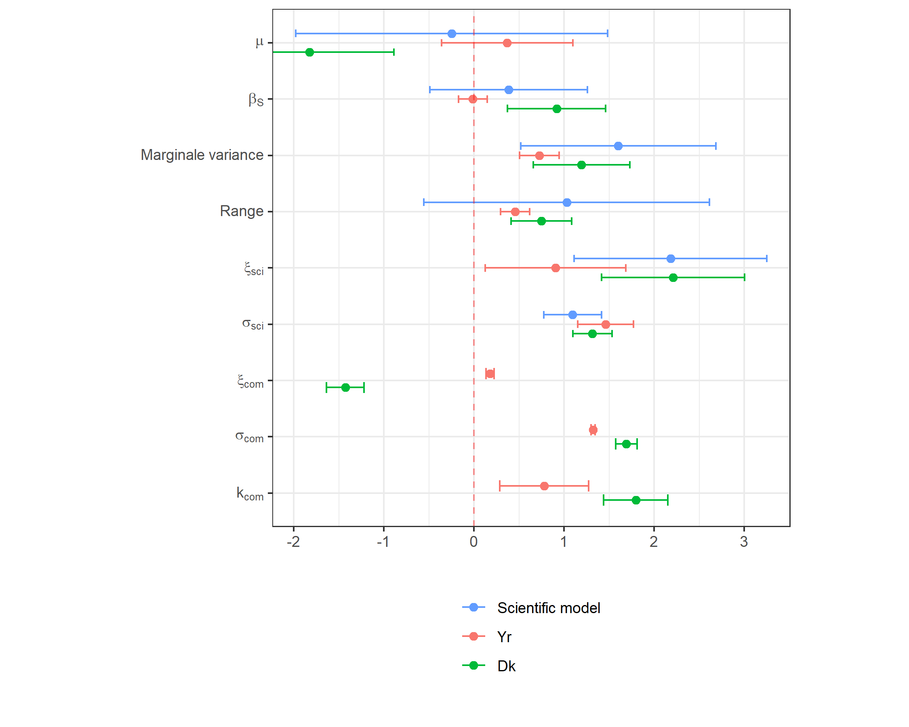
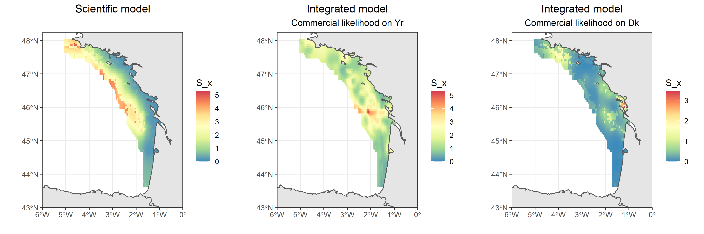

```{r setup, include = FALSE}
library(cowplot)
library(doBy)
library(dplyr)
library(ggplot2)
library(ggpubr)
library(kableExtra)
library(knitr)
library(latex2exp)
library(mapdata)
library(scales)
library(papaja)
library(rnaturalearth)
library(sf)
```

```{r analysis-preferences}
# Seed for random number generation
set.seed(42)
knitr::opts_chunk$set(cache.extra = knitr::rand_seed)

mapBase <- map("worldHires", fill = T, plot = F)
mapBase <- st_as_sf(mapBase) %>% filter(ID %in% c("France","Spain"))
```

# Introduction

Spatial ecological data are becoming more and more accessible every days thanks to the huge effort from the scientific community to provide information in the blind spots of ecology, evolution and conservation [@nathan2022big,@hampton2013big,@gremillet2022big]. These data are crucial to face the current challenges related to large scales ecological issues (e.g. tracking global change - @maureaud_are_2020) as well as smaller scale questions (e.g. tracking animal movement - @nathan2022big). However, these new data are highly heterogeneous in size, type and sampling design making there combination a methodological challenge [@pacifici2017integrating,@fletcher_practical_2019,@miller2019recent,@renner2019combining,@isaac2020data]. 
For instance, ones often compare scientific survey data - that benefit from a controlled sampling plan and standard protocol - to citizen science data - that provide more data but that is also caracterized by misreporting or opportunistic sampling and then by potential sampling bias [@botella2021jointly,@steen2021spatial]. Another less frequently mentionned data are declarations data. We refer to declaration data as the mandatory data that must be reported by some agent as a legal requirement to proceed with his activity. As they are mandatory, declaration data are usually very large datasets such as commercial catch declarations data in fisheries science [@hintzenVMStoolsOpensourceSoftware2012] or harvest data in hunting [@bauder2021mismatched,@gilbert2021integrating]; such way, these may be very informative of species spatial ecology. However, they are often declared at the scale of coarse spatial units while scientific survey (and commonly citizen science data) are usually reported with their exact locations. Furthermore, these administrative units do not generaly have a resolution that is relevant for ecological analysis and conservation [@pacifici2019resolving]. Developing methods to infer spatial ecological process at a fine scale from coarse declarations data and integrate these with higher resolution data is then a challenge that will give access to huge amount of information.


In the statistical literature, these issues are classified within "change of support" (COS) issues. It is recognized as a   Broadly speaking, COS is 


Combining these may require extra-care and a critical look at the data as well as methodological development to correct for these bias [@fletcher_practical_2019,@miller2019recent]. 


Typically, data may be recorded following a standardized sampling plan with a controlled protocol. These data are considered as high quality data; however, they are often characterized by a low amount of samples due to the technical support they require and to their sampling cost. These are typically referred to as 'scientific survey' data (see for instance, the DATRAS online database which gathers the data from the main European Trawl scientific surveys [@ices_report_2014]). Alternatively, data may have been recorded from opportunistic sampling The strong development of citizen science data have allowed to provide additionnal information relying on volunteers to record data 


Recently, methods have been developped to combine high quality data benefiting from a standardized protocol and controled sampling plan with opportunistically sampled data that are 


the increasing amount of citizen science data


They provide standardized ecological data on demersal fish over the whole European shelf. Alternatively, the Ebird plateform provide citizen science records of birds and is today extensively used in spatial and population models for ecological and conservation purposes [@sullivan2014ebird]. 

 and new methods have been developped to integrate all these datasources  .


References for change of support issues in integrated modelling:

https://esajournals.onlinelibrary.wiley.com/doi/epdf/10.1002/ecy.2710

https://besjournals.onlinelibrary.wiley.com/doi/full/10.1111/2041-210X.12793

https://www.sciencedirect.com/science/article/pii/S0169534719302551#b0010

https://www.sciencedirect.com/science/article/pii/S0006320721001993


# Material and methods

We base our approach on the model developped by @alglave_combining_2022. In this framework, all observations were supposed to be realised at a fine scale. Here, we extend the framework to potentially provide fine scale predictions from data that have a coarse resolution (landings data) and combine these data with other fine scale datasets such as scientific data.

## Defining the problem from a modelling point of view

**Definition of the variables**

Let's define the latent field $S$ and the punctual observations $Y$. $S$ is a spatial log-Gaussian Field (GF) defined as $\log(S(x))=\mu+\beta . \Gamma(x) + \delta(x)$ (Figure \@ref(fig:SchemeRealloc)). We consider a discrete study domain where $x \in [\![1,n]\!]$ stands for the discrete locations. $\beta . \Gamma(x)$ is the covariate term with $\Gamma$ the matrix of design of the covariates and $\beta$ the effect of the covariates. $\delta(x)$ is a GF capturing spatial correlation ($\delta \sim \mathcal{N}(0,\Sigma)$).

All fishing locations $x_i$ are supposed to be known through VMS data. At each fishing location $x_i$, fishermen realize a catch $Y_i$ conditionnally on the latent field values (referred hereafter as a punctual catch). Observations are supposed to follow some distribution $\mathcal{L}_Y$.

$$Y_i | S(x_i), x_i \sim \mathcal{L}_Y(S(x_i),\xi,\sigma^2)$$

In our case, observations are zero-inflated positive continuous data and they are modelled through a zero-inflated lognormal model previously introduced by @thorson_three_2018 and already used in @alglave_combining_2022. $\mathcal{L}_Y$ is decomposed it 2 parts:

- the probability to obtain a zero-catch which is modelled as a Bernoulli variable with probability $p_{i}=\exp(-e^\xi .S(x_{i}))$. $\xi$ is a parameter controlling zero-inflation. When $\xi$ increases, the amount of zero in the data decreases.

- if the catch is positive, the probability to obtain some observation value $y_i$ is modelled through a positive continous distribution $\operatorname{L}$ (here a lognormal distribution - its parameterization is described in SM)) with mean component $\frac{S(x_{i})}{1-p_{i}}$ and variance term $\sigma^2$.

$$
\operatorname{P}\left(Y_i=y_{i} | x_i, S(x_i)\right) =
\left\{
    \begin{array}{ll}
        p_i & \text { if } y_{i}=0 \\
        \left(1-p_i\right) \cdot \operatorname{L}\left(y_{i },\frac{S(x_i)}{\left(1 - p_i\right)},\sigma^{2} \right) & \text { if } y_{i} > 0
    \end{array}
\right.
$$

Fishermen must declare what they catch at the level of the statistical rectangle at a daily time step. These data are recorded in logbooks data. A declaration (denoted $D_j$) is a summation of all the $Y_i$ realized on the fishing positions belonging to the catch declaration $D_j$. They can be expressed as:

$$D_j=\sum_{i \in \mathcal{P}_j}{Y_{i}}$$

$\mathcal{P}_j$ is the vector of the fishing observations belonging to the declaration $D_j$. The punctual observations $Y_i$ are indexed through $i \in [\![1,m_j]\!]$ with $m_j$ the number of fishing positions belonging to the $j^{th}$ declaration.


**Catch reallocation: uniform reallocation or model-based reallocation**

In standard processing, $D_j$ (available from logbooks) are reallocated uniformly on related $x_i$ (available from VMS) so that derived punctual observations $Y^*_i$ are computed as $Y^*_i=D_j/m_j$. This is what we call uniform (or proportional) reallocation. In this case, inference of species distribution is directly computed through reallocated $Y^*_i$ assuming these are the exact punctual observations. This strongly simplifies the actual process of observation and have most likely repercussion on model performance.

To overcome such limitation, an alternative is to consider that only the catch declarations $D_j$ are observed while $Y_i$ are not (they are latent variables). Such way, we define some distribution $\mathcal{L}_D$ as the distribution of the catch declarations:

$$D_j | \mathcal{P}_j,S_{\mathcal{P}_j} \sim \mathcal{L}_D( S_{\mathcal{P}_j},\xi,\sigma^2)$$ 

with $S_{\mathcal{P}_j}=(S(x_1),...,S(x_i), ...,S(x_{m_j}))$, $\xi$ the zero-inflation parmeter and $\sigma^2$ the variance parameter. As $D_j=\sum_{i \in \mathcal{P}_j}{Y_{i}}$, it is possible to relate $D_j$, $Y_i$ and $S_{\mathcal{P}_j}$ through the distribution $\mathcal{L}_Y$ and $\mathcal{L}_D$. Our approach is to match the moments of $D_j$ (obtained from the moments of $\mathcal{L}_Y$) and $\mathcal{L}_D$ and then to infer $S(x)$ and $Y_i$ from $D_j$. This is what we call model-based reallocation. This model will be referred as the $D_j$ model. In contrast, the model fitted on reallocated observations $Y^*_i$ will be referred as the $Y^*_i$ model.

In the following, $Y$ and $D$ will be assumed conditionnal on the fishing positions and the latent field values, but for notation simplicity they will be simply denoted as $Y_i$ or $D_j$ instead of $Y_i \vert x_i, S(x_i)$ and $D_j | \mathcal{P}_j,S_{\mathcal{P}_j}$.

**Matching $\mathcal{L}_Y$ and $\mathcal{L}_D$**

First, as at the punctual level ($Y$), the declarations can be decomposed in 2 components: (1) the probability to obtain a zero-value declaration and, if the declaration is positive, (2) the probability to obtain some declaration value $d_j$.

(1) We derive the probability to obtain a zero-declaration $P(D_j = 0)$ by simply multiplying the probability to obtain a zero-punctual observation $P(Y_i=0 )$ to all fishing points $x_i \in \mathcal{P}_j$.

\begin{align*}
P(D_j = 0) & = \prod_{i\in \mathcal{P}_j} P(Y_{i} = 0),\nonumber \\
                      & = \exp{ \left \lbrace- \sum_{i\in \mathcal{P}_j} e^{\xi}. S(x_{i})\right \rbrace} = \pi_j.
\end{align*}


(2) If the declaration is positive, we assume the probability to obtain catch $d_j$ follows a continous distribution $\mathcal{L}_{D_j|D_j>0}$ with mean component $\mu_j$ and variance component $\sigma_j$. From $\mathcal{L}_Y$ we can derive $E(D_j \vert D_j > 0)$ and $Var(D_j \vert D_j > 0)$ (given below) and re-express $\mu_j$ and $\sigma_j$ as a function of these two moments.

$$E(D_j \vert D_j > 0)=\frac{\sum_{i \in \mathcal{P}_j} S(x_{i})}{1-\pi_j}$$
$$Var(D_j \vert D_j > 0) = \frac{\sum_{i \in \mathcal{P}_j} Var(Y_{i})}{1-\pi_j} - \frac{\pi_j}{(1-\pi_j)^2}E(D_j)^2$$
$$Var(Y_{i})=\frac{S(x_{i})^2}{1-p_{i}}(e^{\sigma^2}-(1-p_{i}))$$

If we consider $\mathcal{L}_{D_j|D_j>0}$ is lognormal (with parameterization described in SM) then, $\mu_j = E(D|D_j>0)$ and $\sigma_j = ln(\frac{Var(D|D_j>0)}{E(D|D_j>0)^2} + 1)$. Such way, by fitting the model on declaration $D_j$ rather than reallocated catch $Y_i$ and linking $\mathcal{L}_D$ to $\mathcal{L}_Y$, we intend to better follow the observation process of the commercial data and potentially improve inference compared with the approximation realized through uniform reallocation. All calculations to obtain these formulas are available in SM. 

The inference is realized through Template Model Builder (TMB), an effective tool to build hierarchical models and perform maximum likelihood estimation through automatic differentiation and Laplace Approximation [@kristensen_tmb_2016].

![(\#fig:SchemeRealloc) Schematic representation of the reallocation process. The biomass field (the background field) depends on a covariate and a spatial random effect. The covariate is the $x$ axis. It has a positive effect on biomass values (i.e. biomass is higher on the right of the grid than on the left). The spatial random effect conduct to a hotspot on the bottom-right of the latent field. The study domain is considered as a statistical rectangle (grey square). Fishermen sample catches in areas of poor biomass where the covariate is relatively low (blue points) and in areas of higher biomass where the covariate is higher and eventually in the hotspot of biomass (orange and red points). These catches belong to the same declaration $j$ and are summed to constitute the declaration $D_j=50$. The declaration is declared at the level of the statistical rectangle. From VMS data, we know the fishing positions $x_i$. In standard processing, $D_j$ are then uniformly reallocated over the fishing positions $x_i$. This strongly homogeneizes the catch. In particular, the effect of the habitat is no more evidenced in the reallocated catch $Y_i^*$.](images/realloc.png)


```{r}

# save(data=gridpolygon_sf_2,file="res/simu_lf.RData")
# 
# plot_1 <- ggplot(gridpolygon_sf_2)+
#   geom_sf(aes(fill=Strue_x),alpha=0.9)+
#   scale_fill_distiller(palette = "Spectral")+
#   theme_void()+theme(legend.position = "none")
# 
# ggsave("images/simu_lf.png",width = 7.5,height = 7.5,dpi = 500)

```


## Simulation-estimation

To evaluate the impact of reallocation on model outputs and how our alternative approach can improve model accuracy, we conduct simulation-estimation.

First, we conduct basic simulations in order to explore the effect of some key variables on model performance and also the base properties of the alternative models. We assume the study domain is a single statistical rectangle, only commercial data feed the model and the expression of the latent field in both simulation and estimation is simplified (the variability only depends on one covariate, not on a spatial random term). These simulations will be referred as "single-square simulations".

Then, we extend the simulation-estimation study to several rectangles to get closer to a real case study configuration. We add a spatial random effect in the latent field (for both simulation and estimation) and we also simulate scientific data (in addition to commercial data) to explore the contribution of both datasets in inference. These simulations will be referred as "multiple-square simulations".

In these two sets of simulation-estimation, the covariate is modelled as a continous GRF that we suppose known at each point of the grid. The covariate effect is fixed to $\beta_S=2$ and the intercept is also fixed to $\mu=2$. Regarding commercial data, the number of fishing pings per declaration is fixed to 10 as it is the average number of fishing locations for a single declaration in real data. All parameterizations are detailed in the Table 1.

Each time we compare several model configurations and evaluate these in regards to 2 metrics:

- the MSPE which quantifies the accuracy of the spatial predictions of the latent field over the spatial domain ($n$ is the number of locations over the grid).

$$MSPE=\frac{\sum_x (S(x) - \hat{S}(x) ) ^2}{n}$$

- the parameter of the species habitat relationship $\beta_S$ compared with its estimate $\hat \beta_S$.

```{r}

df <- data.frame(v1=c("$\\mu$","$\\beta_S$","$\\text{Range}$","$\\text{Marginal variance}$","$\\xi_{com}$","$\\sigma_{com}$","$k_{com}$","$\\xi_{sci}$","$\\sigma_{sci}$"),
                 v2=c("2","2"," -- "," -- ","-1","1"," -- "," -- "," -- "),
                 v3=c("2","2","1.5","0.5","-1","1","1","0","0.8"))

# italic column headers
colnames(df) <- c("\\text{Parameters}","\\text{Single-square simulations}","\\text{Multiple-square simulations}")

kable(df, "latex", align=c("l","c","c"), booktabs=TRUE, escape = F, caption = 'Parameter values for the simulations')

table_param <- t(data.frame(
  c("$\\mu$","2","2"),
  c("$\\beta_S$","2","2"),
  c("$\\text{Range}$"," -- ","1.5"),
  c("$\\text{Marginal variance}$"," -- ","0.5"),
  c("$\\xi_{com}$","-1","-1"),
  c("$\\sigma_{com}$","1","1"),
  c("$k_{com}$"," -- ","1"),
  c("$\\xi_{sci}$"," -- ","0"),
  c("$\\sigma_{sci}$"," -- ","0.8")
  ))

```


**Single-square simulations**

Two important variables may affect the accuracy of model outputs: the amount of commercial data and the number of fishing zones explored within one single declaration. In these simulations-estimations, we intend to explore the effect of these 2 variables.

First, the amount of commercial data; it is expected that when increasing the amount of data the accuracy of the predictions will be improved. In simulations, we progressively increase the number of fishing positions (10, 100 and 1000 fishing pings). As there are 10 pings per declaration, this means that the number of declarations increases respectively (1, 10 and 100 declarations).

Furthermore, the samples belonging to a single declaration can be sampled in a single restricted zone or can mix catches from distinct zones (within a unique statistical rectangle). Note that we make a distinction between fishing zones and statistical rectangles: fishing zones are included in a statistical rectangle and there can be several fishing zones within a statistical rectangles. Consequently, a declaration can mix catches that have been realized in zones of high biomass and in zones of low biomass. For instance, a declaration can aggregate data from several fishing operations that occured the same day within the same statistical rectangle, but that were realized on 2 distinct types of fishing grounds (and then on two distinct habitats). Reallocating uniformly the declaration will strongly homogeneise the actual catch, will mix up information from to different grounds and then may lead to a strong loss of accuracy in model outputs. It is expected that when the number of fishing zones within a declaration increases, the accuracy of the model outputs decreases. To assess the effect of such process, we simulated the pings of a fishing declaration assuming they were either realized in a single zone, in 3 distinct zones or in 5 distinct zones.

Concretely, for each fishing declaration the fishing pings are sampled in 2 steps: first the centroid of the zones are randomly sampled over the statistical rectangle (here the simulation domain) and then the fishing positions are randomly sampled within the radius of the centroid of the zones. The zone size was chosen to be a square of side 7. This is a realistic order of magnitude if we consider each zone is one fishing operation and that for each fishing operation the distance of the operation will not exceed 30km.

<!--  One fishing operation is about 3 or 4 hours at a speed of 4 nodes (7.4 km/h) so it makes a distance between 22 and 29 km. If we consider the side of the study domain (here a 25 x 25 grid) is $1° \approx 80km$ (as France is at 45° of latitude), a 7 cell zone is equivalent to a 22 km zone. -->

At each fishing position, a catch is realized conditionnally on the value of the latent field and follow the probability distribution described above ($\mathcal{L}_y$).

We compare three simulation/estimation configurations:

- a golden standard configuration: punctual observations ($Y_i$) are known exactly and the punctual-data model is fitted to the exact data.

- a configuration corresponding to the actual situation (uniform reallocation): simulated catches are summed into declarations and reallocated over the related fishing locations. We then fit the $Y_i^*$ model (the model fitted to punctual reallocated data).

- a configuration corresponding to our alternative approach: simulated catch are reallocated over fishing locations and we fit the $D_j$ model to the data (i.e. the one fitted at the level of the declarations data).

In addition to the metrics we introduced to compare model configuration ($MSPE$ and species-habitat parameter $\beta_S$), we also assess the simulated/estimated values for the intercept $\mu$, the observation variance parameter $\sigma^2$ and the zero-inflation parameter $\xi$.

**Multiple-square simulations**

In this case, we extend the study to more than one single rectangle, we simulate scientific data and include these in inference. Finally, in addition to the covariate, we also simulate/estimate a spatial random effect in the latent field as a Matérn GRF.

The study area is based on the case study; it includes the whole coast of the Bay of Biscay and cover several statistical rectangles (Figure \@ref(fig:MapSeveral)A). To tailor the case study, we simulate 3000 of fishing positions regrouped in 300 declarations (10 pings per declaration). Commercial data may not cover the full area, and consequently we allow the commercial samples to cover only 2/3 ot the area. Similarly to the single-square simulations, the sampling of the commercial points of a declaration are realized in 3 steps. (1) The declaration is randomly affected to one of the ICES rectangle. (2) The centroid of the fishing zone is randomly sampled within this statistical rectangle. (3) The 10 fishing punctual observations are randomly sampled within the fishing zone. The radius of the fishing zone is set so as the extent of a fishing operation does not exceed 30 km. Note that we do not explore the effect of exploring several zones within the same declaration as it is already done in the single-square simulations.

100 scientific samples are simulated following a random stratified plan; contrarly to commercial data they cover the entire study domain (Figure \@ref(fig:MapSeveral)A). Scientific observations are simulated following the observation equations of $\mathcal{L}_Y$ (with specific parameters for scientific data - Table 1). 

We compare several model configurations:

- to assess what brings our alternative approach, we compare the $Y^*_i$ model and the $D_j$ model.

- to assess the information brought by each data source, we compare models built on scientific data only (scientific-based models), models built on commercial data only (commercial-based models) and models combining both data sources (integrated models).

In addition to the 2 metrics introduced at the beginning of the section ($MSPE$ and species-habitat parameter $\beta_S$), we also compare the simulated/estimated values of the range parameter.

Note that when including 2 datasets in the model, a difference in catchability should be accounted for and one of the two dataset will be considered as reference (see @alglave_combining_2022 for more details on parameterization). Here the reference level is set with scientific data and the parameter $k_{com}$ accounts for the relative ratio between scientific and commercial observation values. In simulations, $k_{com}$ is set to 1 so that both datasources are assumed to have the same catchability. 


## Case-study: sole of the Bay of Biscay

To illustrate our method on a real case study, we applied the approach to the common sole of the Bay of Biscay. VMS-logbooks data were extracted for the bottom trawlers fleet (OTB). The methods to cross VMS-logbooks data and to filter the fleet is already extensively described in the previous papers [@alglave_combining_2022] and is not developped further here. Scientific data were extracted from the DATRAS database for the Orhago beam trawl survey [@biais_gerard_orhago_2003;@ices_report_2018]. To align the commercial and the scientific data, we filtered scientific data based on the minimum size of sole (24 cm for sole - @ices_report_2018-1). To illustrate the method, we compare the outputs of (1) the scientific-based model, (2) the integrated model fitted to scientific data and reallocated commercial data ($Y^*_i$ model) and (3) the integrated model fitted to scientific and declarations data ($D_j$ model).

The $D_j$ model faced convergence issues (some of the parameters were hardly estimated e.g. the range parameter). To ease convergence, we integrated in the analysis onboard observer data for the same fleet. They are considered as exact commercial data of catches. Integrating these data allow to have direct information on $Y_i$ and to better estimate the observation equations parameters (i.e. observation variance and zero-inflation parameter of commercial data).

Furthermore, we adopt a step estimation procedure to initialize the optimization algorithm for the $D_j$ model. We first fit the $Y^*_i$ model and use the estimates of the model to initialize the optimization of the $D_j$ model. We eventually fix the parameters that are hard to estimate in first steps of optimization (intercept $\mu$, covariate effect $\beta_S$, range and marginal variance) and let them free iteratively.


# Results

## Single-square simulations

```{r,warning=F}

load("res/Results_full_single_square.RData")

## Table of convergence
Results_conv <- Results
Results_conv$one <- 1
Results_conv_2 <- summaryBy(Convergence+one~
                              sequencesdepeche+
                              # zonespersequence+
                              aggreg_obs+
                              # b_true+
                              n_samp_com+
                              reallocation,
                            data=Results_conv,
                            FUN=sum) %>%
  dplyr::select(n_samp_com,
                sequencesdepeche,
                # zonespersequence,
                reallocation,
                aggreg_obs,
                Convergence.sum,
                one.sum) %>%
    mutate(aggreg_obs = ifelse(aggreg_obs == T,"Dj","Yi"),
           reallocation = ifelse(reallocation == 1,"Yes","No"),
           perc_convergence = round((1 - Convergence.sum / one.sum)*100,digits = 3)) %>%
  mutate(aggreg_obs = ifelse((aggreg_obs == "Yi" & reallocation == "Yes"),"Yi*",aggreg_obs))

Results_conv_2$n_samp_com <- as.integer(Results_conv_2$n_samp_com)
Results_conv_2$sequencesdepeche <- as.integer(Results_conv_2$sequencesdepeche)

Results_conv_2 <- Results_conv_2 %>%
  dplyr::rename(`Fishing positions` = n_samp_com,
                `Declarations` = sequencesdepeche,
                `Reallocation` = reallocation,
                `Likelihood level` = aggreg_obs,
                `Convergence (%)` = perc_convergence) %>%
  dplyr::select(-Convergence.sum,-one.sum)

```


```{r,warning=F}

## Plot Performance metric
Results <- Results %>%
  filter(b_true == 0 & Convergence == 0)
Results[,"RelBias_N"]=(Results[,"N_est"]-Results[,"N_true"])/Results[,"N_true"]
Results[,"RelBias_beta"]=(Results[,"beta1_est"]-Results[,"beta1_true"])/Results[,"beta1_true"]
Results[,"Bias_b"]=(Results[,"b_est"]-Results[,"b_true"]) / ifelse(Results[,"b_true"] != 0,Results[,"b_true"],1)
Results[,"Bias_sigma_com"]=(Results[,"sigma_com_est"]-Results[,"sigma_com_true"]) / Results[,"sigma_com_true"]
Results[,"Bias_q1_com"]=(Results[,"q1_com_est"]-Results[,"q1_com_true"]) / Results[,"q1_com_true"]
Results[,"Bias_intercept"]=(Results[,"intercept_est"]-Results[,"intercept_true"]) / Results[,"intercept_true"]

Results <- Results %>%
  mutate(relloc_aggreg = paste0("Reallocation: ",ifelse(reallocation==0,"No","Yes")," -  Likelihood: ",ifelse(aggreg_obs==T,"Dj","Yi"))) %>%
  mutate(relloc_aggreg = ifelse(aggreg_obs == F & reallocation == 1,"Reallocation: Yes -  Likelihood: Yi*",relloc_aggreg))


Results$zonespersequence <- as.factor(Results$zonespersequence)
Results$b_true <- as.factor(Results$b_true)
Results$relloc_aggreg <- factor(Results$relloc_aggreg,
                                levels = c("Reallocation: No -  Likelihood: Yi",
                                           "Reallocation: Yes -  Likelihood: Yi*",
                                           "Reallocation: Yes -  Likelihood: Dj"))

Results_2 <- Results %>%
  filter(n_samp_com > 10)

MSPE_S_plot <- ggplot()+
  geom_boxplot(data = Results_2,
               aes(x = zonespersequence,
                   y = mspe,
                   fill = relloc_aggreg),
               outlier.colour = NA)+
  theme_bw()+
  facet_wrap(.~factor(n_samp_com))+
  theme(legend.title = element_blank(),
        legend.position = "none",
        aspect.ratio = 1)+
  ylab("MSPE")+
  xlab("")+
  scale_y_log10(breaks = trans_breaks("log10", function(x) 10^x),
                labels = trans_format("log10", math_format(10^.x)))+
  scale_fill_manual(breaks = c("Reallocation: No -  Likelihood: Yi",
                                "Reallocation: Yes -  Likelihood: Yi*",
                                "Reallocation: Yes -  Likelihood: Dj"),
                     values=c("gold","#F8766D","#00BA38"))

Beta_plot <- ggplot()+
  geom_boxplot(data = Results_2,
               aes(x = zonespersequence,
                   y = beta1_est,
                   fill = relloc_aggreg),
               outlier.colour = NA)+
  geom_hline(yintercept = 0,linetype="dashed")+
  geom_hline(yintercept = 2,col="red",linetype="dashed")+
  theme_bw()+
  facet_wrap(.~factor(n_samp_com))+
  theme(legend.title = element_blank(),
        legend.position = "none",
        aspect.ratio = 1)+
  # ylim(-1,1)+ 
  ylab(parse(text = TeX('$\\beta_S$')))+
  xlab("")+
  scale_fill_manual(breaks = c("Reallocation: No -  Likelihood: Yi",
                                "Reallocation: Yes -  Likelihood: Yi*",
                                "Reallocation: Yes -  Likelihood: Dj"),
                     values=c("gold","#F8766D","#00BA38"))

RelBias_N_plot <- ggplot()+
  geom_boxplot(data = Results_2,
               aes(x = zonespersequence,
                   y = RelBias_N,
                   fill = relloc_aggreg),
               outlier.colour = NA)+
  geom_hline(yintercept = 0,linetype="dashed")+
  theme_bw()+
  facet_wrap(.~factor(n_samp_com))+
  theme(legend.title = element_blank(),
        aspect.ratio = 1,
        legend.position = 'none')+
  ylim(-1,1)+
  ylab("Relative bias of biomass")+
  xlab("")+
  scale_fill_manual(breaks = c("Reallocation: No -  Likelihood: Yi",
                                "Reallocation: Yes -  Likelihood: Yi*",
                                "Reallocation: Yes -  Likelihood: Dj"),
                     values=c("gold","#F8766D","#00BA38"))

legend <- as_ggplot(cowplot::get_legend(MSPE_S_plot+theme(legend.position="right",legend.title = element_blank())))

Perf.metric_single_square <- plot_grid(MSPE_S_plot,
                                       Beta_plot,
                                       # RelBias_N_plot,
                                       legend,
                                       ncol = 1,
                                       rel_heights = c(1,1,0.25))

ggsave("images/Perf.metric_single_square.png",width = 5*1.25, height = 6.5*1.25)

Results_3 <- Results_2 %>%
  filter(n_samp_com == 1000)

q1_plot <- ggplot()+
  geom_boxplot(data = Results_3,
               aes(x = relloc_aggreg,
                   y = q1_com_est,
                   fill = relloc_aggreg),
               outlier.colour = NA)+
  geom_hline(yintercept = 0,linetype="dashed")+
  geom_hline(yintercept = -1,col="red",linetype="dashed")+
  theme_bw()+
  theme(legend.title = element_blank(),
        legend.position = "none",
        aspect.ratio = 1,
        axis.text.x = element_blank(),
        axis.ticks.x = element_blank(),
        plot.title = element_text(hjust = 0.5))+
  scale_fill_manual(breaks = c("Reallocation: No -  Likelihood: Yi",
                               "Reallocation: Yes -  Likelihood: Yi*",
                               "Reallocation: Yes -  Likelihood: Dj"),
                    values=c("gold","#F8766D","#00BA38"))+
  xlab("")+ylab(parse(text = TeX('$\\xi$')))+
  ggtitle("Zero-inflation parameter")

sigma_plot <- ggplot()+
  geom_boxplot(data = Results_3,
               aes(x = relloc_aggreg,
                   y = sigma_com_est,
                   fill = relloc_aggreg),
               outlier.colour = NA)+
  geom_hline(yintercept = 0,linetype="dashed")+
  theme_bw()+
  theme(legend.title = element_blank(),
        legend.position = "none",
        aspect.ratio = 1,
        axis.text.x = element_blank(),
        axis.ticks.x = element_blank(),
        plot.title = element_text(hjust = 0.5))+
  scale_fill_manual(breaks = c("Reallocation: No -  Likelihood: Yi",
                               "Reallocation: Yes -  Likelihood: Yi*",
                               "Reallocation: Yes -  Likelihood: Dj"),
                    values=c("gold","#F8766D","#00BA38"))+
  xlab("")+ylab(parse(text = TeX('$\\sigma^2$')))+
  ggtitle("Observation variance parameter")+
  geom_hline(yintercept = 1,col="red",linetype="dashed")


intercept_plot <- ggplot()+
  geom_boxplot(data = Results_3,
               aes(x = relloc_aggreg,
                   y = intercept_est,
                   fill = relloc_aggreg),
               outlier.colour = NA)+
  geom_hline(yintercept = 0,linetype="dashed")+
  theme_bw()+
  theme(legend.title = element_blank(),
        legend.position = "none",
        aspect.ratio = 1,
        axis.text.x = element_blank(),
        axis.ticks.x = element_blank(),
        plot.title = element_text(hjust = 0.5))+
  scale_fill_manual(breaks = c("Reallocation: No -  Likelihood: Yi",
                               "Reallocation: Yes -  Likelihood: Yi*",
                               "Reallocation: Yes -  Likelihood: Dj"),
                    values=c("gold","#F8766D","#00BA38"))+
  xlab("")+ylab(parse(text = TeX('$\\mu$')))+
  ggtitle("Intercept of the latent field")+
  geom_hline(yintercept = 2,col="red",linetype="dashed")

par_plot <- plot_grid(q1_plot,sigma_plot,intercept_plot,nrow = 1,align = "hv")

legend <- as_ggplot(cowplot::get_legend(q1_plot+theme(legend.position="bottom",legend.title = element_blank())))

par_plot <- plot_grid(par_plot,legend,rel_heights = c(1,0.08),ncol=1)

ggsave("images/par_plot_single_square.png",width = 10.5, height = 4)

```

Reallocation has a major effect on predictions and estimates accuracy (Figure \@ref(fig:PerfMetricSingle)). Reallocating data conduct to a 10 to 200 times decrease in accuracy for spatial predictions when fitting the model to reallocated catch (MSPE gold compared to red boxplots). Accuracy decreases as the number of visited zones within a declaration increases. Besides, $\beta_S$ estimates are biased and reallocation leads to the loss of the species-habitat relationship as the number of fishing zones (within a declaration) increases ($\beta_S$ estimates get closer to 0). Increasing the number of samples does not improve inference. Regarding other parameters estimates, the zero-inflation parameter ($\xi$) is over-estimated (i.e. when uniformly reallocating commercial data, the quantity of positive observations is under-estimated), the observation variance ($\sigma$) is underestimated (i.e. the data is estimated to be less noisy than they actually are) and the intercept of the latent field ($\mu$) is slightly over-estimated (Figure \@ref(fig:ParBiasSingle)).

The $D_j$ model allows to recover the species-habitat relationship and to improve the accuracy of the spatial predictions (Figure \@ref(fig:PerfMetricSingle)). Still, the $D_j$ model outputs are not as accurate as the ones of the golden-standard. Furthermore, the zero-inflation parameter is unbiased when the model is fitted to catch declarations $D_j$. Other parameters (observation variance, intercept) are also better estimated even though they remain slightly biased (Figure \@ref(fig:ParBiasSingle)). This alternative model have some convergence difficulties (Table 2) as 8% of the model did not converged when sample size is medium (100 pings) and only 3% did not when sample size is large (1000 pings).

![(\#fig:PerfMetricSingle) Performance metric for single-square simulations. Columns: number of commercial fishing positions. x-axis: number of zones visited within each declaration. 'Reallocation: ', data are or are not reallocated in simulations. 'Likelihood: ', the likelihood is computed on exact punctual observations $Y_i$, on reallocated observations $Y_i^*$ or on catch declarations $D_j$. Gold: golden standard. Red: uniform reallocation ($Y_i^*$ model). Green: model-based reallocation ($D_j$ model). Simulations conducted on 10 fishing positions are not represented as they mostly did not converged for the $D_j$ model (see Table 2).](images/Perf.metric_single_square.png){width=75%}

![(\#fig:ParBiasSingle) Parameters relative bias for single-square simulations. 'Reallocation: ', data are or are not reallocated in simulations. 'Likelihood: ', the likelihood is computed on exact punctual observations $Y_i$, on reallocated observations $Y_i^*$ or on catch declarations $D_j$. Gold: golden standard. Red: uniform reallocation ($Y_i^*$ model). Green: model-based reallocation ($D_j$ model). Only the simulations with 1000 fishing positionss are represented. Black line: zero value. Red line: parameter true value.](images/par_plot_single_square.png)


```{r}

knitr::kable(Results_conv_2,booktabs = T,align = "c",
                  caption = "Single-square simulations - Percentage of convergence per simulation-estimation configuration.")

```

\newpage

## Multiple-square simulations

```{r,warning=F}

load("res/Results_full_multi_square.RData")

Results_conv <- Results_2
Results_conv$one <- 1

Results_conv_2 <- summaryBy(converge+one~
                              Model+
                              aggreg_obs,
                            data=Results_conv,
                            FUN=sum) %>%
  dplyr::select(Model,
                aggreg_obs,
                converge.sum,
                one.sum) %>%
    mutate(aggreg_obs = ifelse(aggreg_obs == T,"Dj","Yi"),
           perc_convergence = round((1 - converge.sum / one.sum)*100,digits = 3))

Results_conv_2$aggreg_obs[which(Results_conv_2$aggreg_obs == "Yi")] <- "Yi*"

Results_conv_2 <- Results_conv_2 %>%
  dplyr::rename(`Likelihood level` = aggreg_obs,
                `Convergence (%)` = perc_convergence) %>%
  dplyr::select(-converge.sum,-one.sum)

Results_conv_2$Model <- factor(Results_conv_2$Model,levels = c("Scientific model", "Commercial model", "Integrated model"))

Results_conv_2 <- Results_conv_2[-which(Results_conv_2$Model == "Scientific model" &
                                          Results_conv_2$`Likelihood level` == "Dj"),]
Results_conv_2$`Likelihood level`[which(Results_conv_2$Model == "Scientific model" &
                       Results_conv_2$`Likelihood level` == "Yi*")] <- " "

```


```{r,warning=F}

Results_plot <- Results_2 %>%
  filter(converge == 0) %>%
  filter(simu_type == "Unsampled Rectangles")

Results_plot[,"RelBias_N"]=(Results_plot[,"N_est"]-Results_plot[,"N_true"])/Results_plot[,"N_true"]
Results_plot[,"RelBias_N.2"]=(Results_plot[,"N_est.2"]-Results_plot[,"N_true.2"])/Results_plot[,"N_true.2"]
Results_plot[,"RelBias_beta"]=(Results_plot[,"beta1_est"]-Results_plot[,"beta1_true"])/Results_plot[,"beta1_true"]

Results_plot$obs <- NA
Results_plot$obs[which(Results_plot$aggreg_obs == T)] <- "Dj"
Results_plot$obs[which(Results_plot$aggreg_obs == F)] <- "Yi*"
Results_plot$obs[which(Results_plot$Estimation_model == 2)] <- "Scientific data"
Results_plot$obs <- factor(Results_plot$obs,levels = c("Yi*","Dj","Scientific data"))

Results_plot$Model[which(Results_plot$Model == "Scientific model")] <- "Scientific"
Results_plot$Model[which(Results_plot$Model == "Commercial model")] <- "Commercial"
Results_plot$Model[which(Results_plot$Model == "Integrated model")] <- "Integrated"

# Results_plot_fullArea <- Results_plot
# Results_plot_UnsampArea <- Results_plot

beta_plot <- ggplot()+
  geom_boxplot(data = Results_plot,
               aes(x = Model,
                   y = beta1_est,
                   fill = obs))+
  geom_hline(yintercept = 0,linetype="dashed")+
  theme_bw()+
  theme(legend.title = element_blank(),
        legend.position = "none",
        aspect.ratio = 1)+
  # facet_wrap(.~simu_type)+
  ylab(TeX("$\\beta_S$")) +
  xlab("")+
  geom_hline(yintercept = 2,col="red",linetype="dashed")+
  scale_color_manual(breaks = c("Scientific model",
                                "Yi*",
                                "Dj"),
                     values=c("#619CFF","#F8766D","#00BA38"))

MSPE_S_plot <- ggplot()+
  geom_boxplot(data = Results_plot,
               aes(x = Model,
                   y = mspe,
                   fill = obs))+
  theme_bw()+
  theme(legend.title = element_blank(),
        legend.position = "none",
        aspect.ratio = 1)+
  # facet_wrap(.~simu_type)+
  ylab("MSPE")+xlab("")+
  scale_color_manual(breaks = c("Scientific model",
                                "Yi*",
                                "Dj"),
                     values=c("#619CFF","#F8766D","#00BA38"))+
  ylim(0,NA)

Range_plot <- ggplot()+
  geom_boxplot(data = Results_plot,
               aes(x = Model,
                   y = Range,
                   fill = obs))+
  geom_hline(yintercept = 0,linetype="dashed")+
  theme_bw()+
  theme(legend.title = element_blank(),
        legend.position = "none",
        aspect.ratio = 1)+
  # facet_wrap(.~simu_type)+
  ylab("Range")+
  xlab("")+
  geom_hline(yintercept = 0.6,col="red",linetype="dashed")+
  scale_color_manual(breaks = c("Scientific model",
                                "Yi*",
                                "Dj"),
                     values=c("#619CFF","#F8766D","#00BA38"))+
  ylim(-0.1,2)

legend <- as_ggplot(cowplot::get_legend(MSPE_S_plot+theme(legend.position="bottom",legend.title = element_blank())))

pl_plot <- plot_grid(MSPE_S_plot,
                     beta_plot,
                     Range_plot,
                     nrow = 1,
                     align="hv")

Perf.metric_multi_square <- plot_grid(pl_plot,
                                      legend,
                                      ncol = 1,
                                      rel_heights = c(1,0.15))

ggsave("images/Perf.metric_multiple_square.png",width = 12, height = 4)

# load("res/lkl_prof_beta.RData")

```

Whether the model is fitted at the punctual level or at the declaration level, the contribution of either scientific or commercial data can be clearly evidenced from the MSPE plot: the errors related to the integrated model are smaller than the single-data models. This can be well illustrated from Figure \@ref(fig:MapSeveral). Integrating scientific and commercial data allows to (1) capture the hotspot missed by commercial data through scientific data and (2) better capture the local correlation structures through the dense commercial data.

Furthermore, consistently with single-square simulations, uniform reallocation conducts to a loss in both the predictions accuracy and the species-habitat relationship (Figure \@ref(fig:PerfMetricSeveral)) compared to the model built on commercial declarations ($D_j$). 

Interestingly, in addition to the species-habitat relationship, uniform reallocation also affects the spatial autocorrelation terms such as the range parameter. The model fitted on reallocated data ($Y_i^*$) provides biased range estimates while the $D_j$ model provides unbiased estimates. This is a consequence of the loss of the species-habitat relationship: when uniformly reallocating declarations, part of the variability related to the covariate effect is captured by the random effect. Consequently, the range parameter captures both the autocorrelation related to the actual random effect and to the covariate. The $D_j$ model allows to recover and disentangle the effect of the species-habitat relationship and of the random effect. This is evidenced in Figure \@ref(fig:MapSeveral) where the model fitted to reallocated catch $Y_i^*$ provides smoothed maps and does not capture the relatively small scale patterns that are shaped by the covariate. On the other hand, the $D_j$ model (as the scientific-based model) better captures and disentangles the covariate effect and the spatial random effect and then provides predictions that better fit to the small-scale patterns of the species distribution. However, this goes with some difficulty in convergence as only 75% of the model built on catch declarations converge (Table 3).


![(\#fig:MapSeveral) Relative distribution of simulated/estimated biomass field. A: Simulated biomass field with scientific samples (red) and statistical rectangles. The rectangles that have not been sampled by commercial data are the transparent rectangles. They represent 1/3 of the full area. B: simulated biomass field. C: biomass field from the scientific-based model. $Y_i^*$: $Y_i^*$ model (D, E). $D_j$: $D_j$ model (F, G). Scientific model: model fitted to scientific data only. Commercial model: model fitted to commercial data only. Integratedd model: model fitted to both data sources.](images/Map_multi_square.png)

```{r}

knitr::kable(Results_conv_2,booktabs = T,align = "c",
                  caption = "Multiple-square simulations - Percentage of convergence per simulation-estimation configuration.")

```


<!-- see the file 'Scripts/In_progress/plot_multiple_square_2.R' -->

## Real case study

```{r}

## Load data
load("res/sci_df.RData")

load("res/realloc_rest_df.RData")

load("res/no.realloc_df.RData")

load("res/est_par_df_full_3.RData")

## Plot maps
no.realloc_plot <- ggplot(no.realloc_df)+
  geom_point(aes(x=x,y=y,col=S_x),shape=15,size=2)+
  scale_color_distiller(palette = "Spectral",limits=c(0,NA))+
  ggtitle("Integrated model",subtitle = "Commercial likelihood on Yi*")+
  theme_bw()+
  theme(plot.title = element_text(hjust = 0.5),
        plot.subtitle = element_text(hjust = 0.5))+
  geom_sf(data = mapBase)+
  coord_sf(xlim = c(-6,0), ylim = c(43,48+0.25), expand = FALSE)+
  xlab("")+ylab("")

realloc_rest_plot <- ggplot(realloc_rest_df)+
  geom_point(aes(x=x,y=y,col=S_x),shape=15,size=2)+
  scale_color_distiller(palette = "Spectral",limits=c(0,NA))+
  ggtitle("Integrated model",subtitle = "Commercial likelihood on Dj")+
  theme_bw()+
  theme(plot.title = element_text(hjust = 0.5),
        plot.subtitle = element_text(hjust = 0.5))+
  geom_sf(data = mapBase)+
  coord_sf(xlim = c(-6,0), ylim = c(43,48+0.25), expand = FALSE)+
  xlab("")+ylab("")

sci_plot <- ggplot(sci_df)+
  geom_point(aes(x=x,y=y,col=S_x),shape=15,size=2)+
  scale_color_distiller(palette = "Spectral",limits=c(0,NA))+
  ggtitle("Scientific model")+
  theme_bw()+
  theme(plot.title = element_text(hjust = 0.5),
        plot.subtitle = element_text(hjust = 0.5))+
  geom_sf(data = mapBase)+
  coord_sf(xlim = c(-6,0), ylim = c(43,48+0.25), expand = FALSE)+
  xlab("")+ylab("")

# plot(log(no.realloc_df$S_x),log(sci_df$S_x))
# cor(log(no.realloc_df$S_x),log(sci_df$S_x),method = "spearman")
# plot(log(realloc_rest_df$S_x),log(sci_df$S_x))
# cor(log(realloc_rest_df$S_x),log(sci_df$S_x),method = "spearman")

case_study_plot <- plot_grid(sci_plot,no.realloc_plot,realloc_rest_plot,ncol=3,align="hv")

ggsave("images/case_study_plot.png",width = 12, height = 4)

## Parameter estimates
est_par_df_full_3$lkl[which(est_par_df_full_3$lkl == "Yi")] <- "Yi*"
est_par_df_full_3$lkl <- factor(est_par_df_full_3$lkl,levels = c("Dj","Yi*","Scientific model"))
est_par_df_full_3 <- est_par_df_full_3 %>%
  filter(par_names != "substr_Sand_Coarse_substrate")
par_plot <- ggplot(est_par_df_full_3, aes(y=par_val, x=par_names))+
  geom_point(
    aes(color = lkl),
    position = position_dodge(0.5),
    size=2
  )+
  geom_errorbar(aes(ymin = CI.inf, ymax = CI.sup, color = lkl),
                position = position_dodge(0.5),width=0.4
  )+
  scale_color_manual(breaks = c("Scientific model",
                                "Yi*",
                                "Dj"),
                     values=c("#619CFF","#F8766D","#00BA38"))+
  geom_hline(yintercept=0, linetype="dashed", color = "red",alpha=0.4)+
  xlab("")+ylab("")+
  theme_bw()+
  theme(legend.title = element_blank(),
        legend.position = "none",
        aspect.ratio = 1)+
  coord_flip()+
  scale_x_discrete(labels=c('k_com'=parse(text = TeX('$k_{com}$')),
                            'Sigma_com'=parse(text = TeX('$\\sigma_{com}$')),
                            'q1_com'=parse(text = TeX('$\\xi_{com}$')),
                            'Sigma_sci'=parse(text = TeX('$\\sigma_{sci}$')),
                            'q1_sci'=parse(text = TeX('$\\xi_{sci}$')),
                            'Range'="Range",
                            'MargSD'="Marginale variance",
                            'substr_Mud_sediment'=parse(text = TeX('$\\beta_{S}$')),
                            'intercept'=parse(text = TeX('$\\mu$'))))


legend <- as_ggplot(cowplot::get_legend(
  par_plot+
    theme(legend.position="right",
          legend.title = element_blank()
          )))

par_plot <- plot_grid(par_plot,legend,ncol=1,rel_heights = c(1,0.25),align="hv")

ggsave("images/par_plot.png",width = 7.5, height = 6)

```

Consistently with simulations, the $D_j$ model modifies some of the parameters estimates and revises the spatial pattern of the species distribution compared with the $Y^*_i$ model. In particular, the substrate effect is recovered in the $D_j$ model and fall in the same range as the scientific-based estimate (Figure \@ref(fig:CaseStudyMap)). The zero-inflation parameter $\xi$ is revised downwards (i.e. there are actually more zero-values than in the reallocated data) while the observation variance of commercial data is revised upwards (i.e. the commercial data are noisier than expected when fitting the model on $Y_i^*$).

In addition, uncertainty is also revised when fitting the model at the declaration level. For instance, when comparing the $Y^*_i$ model to the $D_j$ model, the confidence intervals of $\beta_S$, the marginal variance, the range, $\xi_{com}$, $\sigma_{com}$ are much wider. This emphasizes that uncertainty is probably underestimated in the $Y^*_i$ model compared with the $D_j$ model. Now, when comparing the scientific-based model and the integrated $D_j$ model, some parameters are better estimated than when only scientific data feed the model. For instance, while in the scientific-based model the substrate effect was not significant, in the integrated model built on $D_j$ substrate is significant and the confidence interval is smaller.

On the contrary, other parameters do not seems be well estimated in either the $Y_i^*$ or the $D_j$ models. For instance, compared to the scientific-based model, the intercept is revised upwards when building the likelihood on $Y_i$ and revised downards when working on $D_j$. This is consistent with simulations results, see Figure \@ref(fig:ParBiasSingle).

Regarding the maps of the species distribution, fitting the model at the $D_j$ level strongly modifies the model biomass field compared with the $Y_i^*$ model. In particular, the substrate covariate have a sharper effect on species distribution and the intensity of the hotspots are revised when fitting the model on $D_j$.

Finally, the $D_j$ model fitted only on commercial data does not converge (while the one fitted on $Y_i^*$ does) emphasizing the model fitted on catch declarations face difficulties to converge and require punctual observations (here survey data and on-board observer data) to converge on real data.





# Discussion


\newpage

# References

\begingroup
\setlength{\parindent}{-0.5in}
\setlength{\leftskip}{0.5in}

<div id="refs" custom-style="Bibliography"></div>
\endgroup


# Supplementary material

**Notations**

We model catch declarations $D_j$ (available at coarse resolution through logbooks data) as a sum of $Y_{i}$ punctual observations (which are unknown i.e. latent variables) each one realised at one fishing position $x_{i}$ (known through VMS data).

We note: 

- $\mathcal{P}_j$ : the vector of all fishing positions related to the $j^{th}$ declaration.

- $j \in \{1,...,l\}$ with $l$ the number of declarations.

- $i \in \{1,...,m_j\}$ with $m_j$ the number of fishing positions belonging to the $j^{th}$ declaration.

$$D_j=\sum_{i \in \mathcal{P}_j}{Y_{i}}$$

**Reparameterization of the lognormal distribution**

The lognormal distribution is usually written as $Z \sim \operatorname{L}(\rho;\sigma^2)$ with $Z=e^{\rho+\sigma N}$ and $N \sim \mathcal{N}(0,1)$. In this case, $E(Z)=e^{\rho + \frac{\sigma^2}{2}}$ and $Var(Z)=(e^{\sigma^2}-1)e^{2 \rho + \sigma^2}$.

We choose to slightly reparameterize the lognormal distribution. Let's define $\rho = ln(\mu) - \frac{sigma^2}{2}$, then:

- $Z=\mu e^{\sigma N - \frac{sigma^2}{2}}$

- $E(Z)=\mu$

- $Var(Z)=\mu^2(e^{\sigma^2} - 1) \Leftrightarrow	\sigma^2=ln(\frac{Var(Z)}{E(Z)^2} + 1)$

**$D_j$ probability distribution and moments**

We have to express the probability distribution of $D_j$ and its moments as a function of $Y_{i}$ and its related moments. Let's assume $Y_{i} = C_{i}.Z_{i}$ is a zero-inflated lognormal distribution with $C_{i}$ a binary random variable and $Z_{i}$ a lognormal random variable.

$$C_{i} \sim \mathcal{B}(1-p_{i})$$ 
with $p_{i}=exp(-e^\xi .S(x_{i}))$ the probability to obtain a zero value.

$$Z_{i} \sim \operatorname{L}(\frac{S(x_{i})}{1-p_{i}},\sigma^2)$$

Here, $Y_{i}$, $C_{i}$ and $Z_{i}$ are observations of a latent field $S(x_{i})$ at a sampled point $x_{i}$.


**Probability of obtaining a zero declaration**

\begin{align*}
P(D_j = 0 \vert S, X) & = \prod_{i\in \mathcal{P}_j} P(Y_{i} = 0 \vert S, X),\nonumber \\
                      & = \exp{ \left \lbrace- \sum_{i\in \mathcal{P}_j} e^{\xi}. S(x_{i})\right \rbrace} = \pi_j.
\end{align*}


**Expectancy of a positive declaration**

Following calculations are supposed to be conditionnal on $S$ and $X$.

$$E(D_j\vert D_j >0) =  \sum_{i\in \mathcal{P}_j} E(C_{i} Z_{i}\vert \exists i\in\mathcal{P}_j , C_{i}=1)$$

\begin{align*}
E(D_j\vert D_j > 0) & = E(D_j 1_{ \left \lbrace D_j > 0\right\rbrace } )  / P\left ( D_j > 0\right ),   \\
& = E(D_j 1_{ \left \lbrace D_j > 0\right\rbrace } )  / \left (1-\pi_j\right).   \\
\end{align*}

As $E(D_j 1_{ \left \lbrace D_j > 0\right\rbrace } ) = E(D_j ),$

\begin{align*}
E(D_j\vert D_j > 0) & = \left (1- \pi_j\right)^{-1} E(D_j)   ,   \nonumber \\
& = \left (1- \pi_j\right)^{-1} \sum_{i\in \mathcal{P}_j} E(C_{i} Z_{i}),\nonumber \\
& = \left (1- \pi_j\right)^{-1} \sum_{i\in \mathcal{P}_j} (1-p_{i}) \frac{S(x_{i})}{1-p_{i}}, \nonumber \\
& = \left (1- \pi_j\right)^{-1}\sum_{i\in \mathcal{P}_j} S(x_{i}).
\end{align*}


**Variance of a positive declaration**

$$Var(D_j \vert D_j >0)  = E(D_j^2 \vert D_j >0)- E(D_j \vert D_j >0)^2.$$

$$E(D_j^2 \vert D_j >0) = (1-\pi_j)^{-1} E(D_j^2 1_{\left \lbrace D_j >0\right\rbrace}) = (1-\pi_j)^{-1} E(D_j^2 )$$

$$E(D_j \vert D_j >0)^2 = ((1-\pi_j)^{-1} E(D_j 1_{\left \lbrace D_j >0\right\rbrace}))^2 =  (1-\pi_j)^{-2} E(D_j)^2$$

Then,

$$Var(D_j \vert D_j >0) = (1-\pi_j)^{-1} E(D_j^2 ) - (1-\pi_j)^{-2} E(D_j)^2 = (1-\pi_j)^{-1} Var(D_j) - \frac{\pi_j}{(1-\pi_j)^2} E(D_j)^2.$$

As the $(Y_{i})_{i\in \mathcal{P}_j}$ are independent, $Var(D_j) =\sum_{i \in\mathcal{P}_j} Var(Y_{i}) = \sum_{i \in\mathcal{P}_j} Var(C_{i}.Z_{i})$.

\begin{align*}
Var(C_{i} Z_{i}) & = E( C_{i}^2 Z_{i}^2 ) - E(C_{i} Z_{i})^2,\\
& =  E( C_{i}^2) E(Z_{i}^2 ) -E(C_{i})^2 E(Z_{i})^2,\\
& = (1-p_{i}) E(Z_{i}^2 ) - (1-p_{i})^2 E(Z_{i})^2,\\
& = (1-p_{i})(Var(Z_{i})+E(Z_{i})^2)-(1-p_{i})^2E(Z_{i})^2,\\
& = \frac{S(x_{i})^2}{1-p_{i}}(e^{\sigma^2}-1)+\frac{S(x_{i})^2}{1-p_{i}}-S(x_{i})^2,\\
& = \frac{S(x_{i})^2}{1-p_{i}}(e^{\sigma^2}-(1-p_{i}))
\end{align*}


**Sum up of the main formulas**

$$P(D_j = 0 \vert S, X) = \exp{ \left \lbrace- \sum_{i\in \mathcal{P}_j} e^{\xi}. S(x_{i})\right \rbrace} = \pi_j$$

$$E(D_j \vert D_j > 0)=\frac{\sum_{i \in \mathcal{P}_j} S(x_{i})}{1-\pi_j}$$


$$Var(D_j \vert D_j > 0) = \frac{\sum_{i \in \mathcal{P}_j} Var(Y_{i})}{1-\pi_j} - \frac{\pi_j}{(1-\pi_j)^2}E(D_j)^2$$

$$Var(Y_{i})=\frac{S(x_{i})^2}{1-p_{j}}(e^{\sigma^2}-(1-p_{i}))$$

Assuming $D_j \vert D_j > 0$ also follows a lognormal distribution we can write:

$$D_j \vert D_j > 0 \sim \operatorname{L}( \mu_j = E(D_j \vert D_j > 0), \sigma_j^2= ln(\frac{Var(D_j \vert D_j > 0)}{E(D_j \vert D_j > 0)^2} + 1))$$


