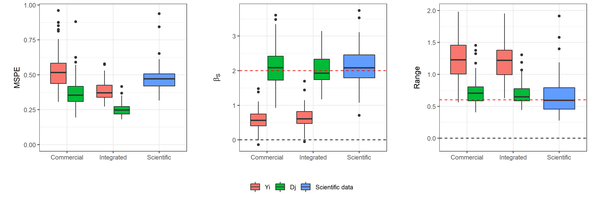

```{r setup, include = FALSE}
library(cowplot)
library(doBy)
library(dplyr)
library(ggplot2)
library(ggpubr)
library(kableExtra)
library(latex2exp)
library(mapdata)
library(scales)
library(papaja)
library(rnaturalearth)
library(sf)
```

```{r analysis-preferences}
# Seed for random number generation
set.seed(42)
knitr::opts_chunk$set(cache.extra = knitr::rand_seed)

mapBase <- map("worldHires", fill = T, plot = F)
mapBase <- st_as_sf(mapBase) %>% filter(ID %in% c("France","Spain"))
```


**To do:**

- **email to Kasper**

- **redaction of M&M**

- **run single square simulations**

- **run multiple square simulations**


References for change of support issues in integrated modelling:

https://esajournals.onlinelibrary.wiley.com/doi/epdf/10.1002/ecy.2710

https://besjournals.onlinelibrary.wiley.com/doi/full/10.1111/2041-210X.12793

https://www.sciencedirect.com/science/article/pii/S0169534719302551#b0010

https://www.sciencedirect.com/science/article/pii/S0006320721001993


# Material and methods

We base our approach on the model developped by @alglave_combining_2022 and build on these developpments to provide a solution to overcome the issues related to change of support in our specific context.

## Defining the problem from a modelling point of view

Let's define the latent field $S$ the punctual observations $Y$. $S$ is a spatial Gaussian Field (GF) defined in space such as $S(x)=\mu+\beta . \Gamma + \delta(x)$. $\beta . \Gamma$ is the covariate term with $\Gamma$ the matrix of deisgn of the coavariates and $\beta$ the effect of the covariates. $\delta(x)$ is GF capturing spatial correlation ($\delta \sim \mathcal{N}(0,\Sigma)$).

Punctual observations $Y_i$ are conditionnal on the latent field values at fishing location $x_i$ for observation $i$. Observations are supposed to follow some distribution $\mathcal{L}_Y$. In our case, data are  positive continuous zero inflated data and they are modelled through a zero-inflated lognormal model described in supplementary material (SM) previously introduced by @thorson_three_2018 and already used in @alglave_combining_2022.

$$Y_i | S(x_i), x_i \sim \mathcal{L}_Y(S(x_i),\xi,\sigma)$$

All observations belong to a catch declaration D_j such as:

$$D_j=\sum_{i \in \mathcal{P}_j}{Y_{i}}$$

$j \in [\![1,n]\!$ is the declaration index with $n$ the number of declarations. $\mathcal{P}_j$ is the vector of all fishing positions related to the $j^{th}$ declaration. The punctual observations $Y_i$ are indexed through $i \in [\![1,m_j]\!$ with $m_j$ the number of fishing positions belonging to the $j^{th}$ declaration.

In standard processing, we know $D_j$ through logbooks data, $x_i$ through VMS data and $D_j$ are reallocated uniformly on related $x_i$ so that derived punctual observations $Y^*_i$ are computed as $Y^*_i=D_j/m_j$. The likelihood is then directly computed on reallocated $Y^*_i$ assuming these are the exact punctual observations. This strongly simplifies the actual process of observation and have most likely repercussion on model performance.

To overcome such limitation, an alternative is to consider that only the catch declarations are observed, but they can inform of the punctual observations $Y_i$ which are not-observed (i.e. they are latent variables).

Such way, we define some distribution $\mathcal{L}_D$ as the distribution of the catch declarations $D_j | S_{\mathcal{P}_j},\mathcal{P}_j \sim \mathcal{L}_D( S_{\mathcal{P}_j},\xi,\sigma)$ with $S_{\mathcal{P}_j}=(S(x_1),...,S(x_i), ...,S(x_{m_j}))$.

Our approach is to match the 2 first moments of $D_j$ (obtained from the moments of $\mathcal{L}_Y$ i.e. $Y_i$ probability distribution) and $\mathcal{L}_D$.

First, as at the punctual level, the declarations can be decomposed in 2 components: (1) the probability to obtain a zero value and, if the declaration is positive, (2) the probability to obtain a certain declaration value.

(1) We derive the probability to obtain a zero-declaration $P(D_j = 0 \vert S_{\mathcal{P}_j},\mathcal{P}_j)$ by simply multiplying the probability to obtain a zero-punctual observation $P(Y_i=0 \vert S(x_i), x_i)$ to all fishing points $x_i \in \mathcal{P}_j$ as $P(D_j = 0 \vert S_{\mathcal{P}_j},\mathcal{P}_j) = \prod_{i \in \mathcal{P}_j} P(Y_i=0 \vert S(x_i), x_i)$.

(2) If the declarations is positive, based on the moments of $\mathcal{L}_Y$, we derive $E(D_j \vert D_j > 0)$ and $Var(D_j \vert D_j > 0)$ (see Table ...). Assuming $D_j|D_j>0$ follows some probability distribution $\mathcal{L}_{D_j|D_j>0}$, we make the two first moments of the $\mathcal{L}_{D_j|D_j>0}$ coincides with $E(D_j \vert D_j > 0)$ and $Var(D_j \vert D_j > 0)$. Considering $\mathcal{L}_{D_j|D_j>0}$ has a lognormal distribution, such link is done through the formulas $\mu_D = E(D|D_j>0)$ for the mean component of $\mathcal{L}_{D_j|D_j>0}$ and $\sigma_D = ln(\frac{Var(D|D_j>0)}{E(D|D_j>0)^2} + 1)$ for its variance component.

Equations of $E(D_j \vert D_j > 0)$ and $Var(D_j \vert D_j > 0)$ are given by:

$$E(D_j \vert D_j > 0)=\frac{\sum_{i \in \mathcal{P}_j} S(x_{i})}{1-\pi_j}$$
$$Var(D_j \vert D_j > 0) = \frac{\sum_{i \in \mathcal{P}_j} Var(Y_{i})}{1-\pi_j} - \frac{\pi_j}{(1-\pi_j)^2}E(D_j)^2$$
$$Var(Y_{i})=\frac{S(x_{i})^2}{1-p_{i}}(e^{\sigma^2}-(1-p_{i}))$$

All calculations to obtain these formulas are available in SM.


```{r}

# save(data=gridpolygon_sf_2,file="res/simu_lf.RData")
# 
# plot_1 <- ggplot(gridpolygon_sf_2)+
#   geom_sf(aes(fill=Strue_x),alpha=0.9)+
#   scale_fill_distiller(palette = "Spectral")+
#   theme_void()+theme(legend.position = "none")
# 
# ggsave("images/simu_lf.png",width = 7.5,height = 7.5,dpi = 500)

```


## Simulation-estimation

### Single-square simulations

How many simulations? 100 or more?

How do we simulate the covariate?

Still some lack of convergence.

Number of pings | nu:
1|10
10|100
100|1000

Size within a fishing sequence: radius = 3

Number of fishing zones: 1|3|5


### Multiple-squares simulations

How do we simulate the covariate?


## Case-study: sole of the Bay of Biscay

# Results

## Single square analysis

```{r,warning=F}

load("res/Results_full_single_square.RData")

## Table of convergence
Results_conv <- Results
Results_conv$one <- 1
Results_conv_2 <- summaryBy(Convergence+one~
                              sequencesdepeche+
                              # zonespersequence+
                              aggreg_obs+
                              # b_true+
                              n_samp_com+
                              reallocation,
                            data=Results_conv,
                            FUN=sum) %>%
  dplyr::select(n_samp_com,
                sequencesdepeche,
                # zonespersequence,
                reallocation,
                aggreg_obs,
                Convergence.sum,
                one.sum) %>%
    mutate(aggreg_obs = ifelse(aggreg_obs == T,"Dj","Yi"),
           reallocation = ifelse(reallocation == 1,"Yes","No"),
           perc_convergence = round((1 - Convergence.sum / one.sum)*100,digits = 3))

Results_conv_2$n_samp_com <- as.integer(Results_conv_2$n_samp_com)
Results_conv_2$sequencesdepeche <- as.integer(Results_conv_2$sequencesdepeche)

Results_conv_2 <- Results_conv_2 %>%
  dplyr::rename(`Nb samples` = n_samp_com,
                `Fishing sequence` = sequencesdepeche,
                `Reallocation` = reallocation,
                `Likelihood level` = aggreg_obs,
                `Convergence (%)` = perc_convergence) %>%
  dplyr::select(-Convergence.sum,-one.sum)

knitr::kable(Results_conv_2,booktabs = T,align = "c",
                  caption = "Percentage of convergence per simulation/model configuration at the level of a single rectangle")

```


```{r,warning=F}

## Plot Performance metric
Results <- Results %>%
  filter(b_true == 0 & Convergence == 0)
Results[,"RelBias_N"]=(Results[,"N_est"]-Results[,"N_true"])/Results[,"N_true"]
Results[,"RelBias_beta"]=(Results[,"beta1_est"]-Results[,"beta1_true"])/Results[,"beta1_true"]
Results[,"Bias_b"]=(Results[,"b_est"]-Results[,"b_true"]) / ifelse(Results[,"b_true"] != 0,Results[,"b_true"],1)
Results[,"Bias_sigma_com"]=(Results[,"sigma_com_est"]-Results[,"sigma_com_true"]) / Results[,"sigma_com_true"]
Results[,"Bias_q1_com"]=(Results[,"q1_com_est"]-Results[,"q1_com_true"]) / Results[,"q1_com_true"]
Results[,"Bias_intercept"]=(Results[,"intercept_est"]-Results[,"intercept_true"]) / Results[,"intercept_true"]

Results <- Results %>%
  mutate(relloc_aggreg = paste0("Reallocation: ",ifelse(reallocation==0,"No","Yes")," -  Likelihood: ",ifelse(aggreg_obs==T,"Dj","Yi")))

Results$zonespersequence <- as.factor(Results$zonespersequence)
Results$b_true <- as.factor(Results$b_true)
Results$relloc_aggreg <- factor(Results$relloc_aggreg,
                                levels = c("Reallocation: No -  Likelihood: Yi",
                                           "Reallocation: Yes -  Likelihood: Yi",
                                           "Reallocation: Yes -  Likelihood: Dj"))

Results_2 <- Results %>%
  filter(n_samp_com > 10)

MSPE_S_plot <- ggplot()+
  geom_boxplot(data = Results_2,
               aes(x = zonespersequence,
                   y = mspe,
                   fill = relloc_aggreg),
               outlier.colour = NA)+
  theme_bw()+
  facet_wrap(.~factor(n_samp_com))+
  theme(legend.title = element_blank(),
        legend.position = "none",
        aspect.ratio = 1)+
  ylab("MSPE")+
  xlab("")+
  scale_y_log10(breaks = trans_breaks("log10", function(x) 10^x),
                labels = trans_format("log10", math_format(10^.x)))+
  scale_fill_manual(breaks = c("Reallocation: No -  Likelihood: Yi",
                                "Reallocation: Yes -  Likelihood: Yi",
                                "Reallocation: Yes -  Likelihood: Dj"),
                     values=c("gold","#F8766D","#00BA38"))

Beta_plot <- ggplot()+
  geom_boxplot(data = Results_2,
               aes(x = zonespersequence,
                   y = beta1_est,
                   fill = relloc_aggreg),
               outlier.colour = NA)+
  geom_hline(yintercept = 0,linetype="dashed")+
  geom_hline(yintercept = 2,col="red",linetype="dashed")+
  theme_bw()+
  facet_wrap(.~factor(n_samp_com))+
  theme(legend.title = element_blank(),
        legend.position = "none",
        aspect.ratio = 1)+
  # ylim(-1,1)+ 
  ylab(parse(text = TeX('$\\beta_S$')))+
  xlab("")+
  scale_fill_manual(breaks = c("Reallocation: No -  Likelihood: Yi",
                                "Reallocation: Yes -  Likelihood: Yi",
                                "Reallocation: Yes -  Likelihood: Dj"),
                     values=c("gold","#F8766D","#00BA38"))

RelBias_N_plot <- ggplot()+
  geom_boxplot(data = Results_2,
               aes(x = zonespersequence,
                   y = RelBias_N,
                   fill = relloc_aggreg),
               outlier.colour = NA)+
  geom_hline(yintercept = 0,linetype="dashed")+
  theme_bw()+
  facet_wrap(.~factor(n_samp_com))+
  theme(legend.title = element_blank(),
        aspect.ratio = 1,
        legend.position = 'none')+
  ylim(-1,1)+
  ylab("Relative bias of biomass")+
  xlab("")+
  scale_fill_manual(breaks = c("Reallocation: No -  Likelihood: Yi",
                                "Reallocation: Yes -  Likelihood: Yi",
                                "Reallocation: Yes -  Likelihood: Dj"),
                     values=c("gold","#F8766D","#00BA38"))

legend <- as_ggplot(cowplot::get_legend(MSPE_S_plot+theme(legend.position="right",legend.title = element_blank())))

Perf.metric_single_square <- plot_grid(MSPE_S_plot,
                                       Beta_plot,
                                       # RelBias_N_plot,
                                       legend,
                                       ncol = 1,
                                       rel_heights = c(1,1,0.25))

ggsave("images/Perf.metric_single_square.png",width = 5*1.25, height = 6.5*1.25)

Results_3 <- Results_2 %>%
  filter(n_samp_com == 1000)

q1_plot <- ggplot()+
  geom_boxplot(data = Results_3,
               aes(x = relloc_aggreg,
                   y = q1_com_est,
                   fill = relloc_aggreg),
               outlier.colour = NA)+
  geom_hline(yintercept = 0,linetype="dashed")+
  geom_hline(yintercept = -1,col="red",linetype="dashed")+
  theme_bw()+
  theme(legend.title = element_blank(),
        legend.position = "none",
        aspect.ratio = 1,
        axis.text.x = element_blank(),
        axis.ticks.x = element_blank(),
        plot.title = element_text(hjust = 0.5))+
  scale_fill_manual(breaks = c("Reallocation: No -  Likelihood: Yi",
                               "Reallocation: Yes -  Likelihood: Yi",
                               "Reallocation: Yes -  Likelihood: Dj"),
                    values=c("gold","#F8766D","#00BA38"))+
  xlab("")+ylab(parse(text = TeX('$\\xi$')))+
  ggtitle("Zero-inflation parameter")

sigma_plot <- ggplot()+
  geom_boxplot(data = Results_3,
               aes(x = relloc_aggreg,
                   y = sigma_com_est,
                   fill = relloc_aggreg),
               outlier.colour = NA)+
  geom_hline(yintercept = 0,linetype="dashed")+
  theme_bw()+
  theme(legend.title = element_blank(),
        legend.position = "none",
        aspect.ratio = 1,
        axis.text.x = element_blank(),
        axis.ticks.x = element_blank(),
        plot.title = element_text(hjust = 0.5))+
  scale_fill_manual(breaks = c("Reallocation: No -  Likelihood: Yi",
                               "Reallocation: Yes -  Likelihood: Yi",
                               "Reallocation: Yes -  Likelihood: Dj"),
                    values=c("gold","#F8766D","#00BA38"))+
  xlab("")+ylab(parse(text = TeX('$\\sigma^2$')))+
  ggtitle("Observation variance parameter")+
  geom_hline(yintercept = 1,col="red",linetype="dashed")


intercept_plot <- ggplot()+
  geom_boxplot(data = Results_3,
               aes(x = relloc_aggreg,
                   y = intercept_est,
                   fill = relloc_aggreg),
               outlier.colour = NA)+
  geom_hline(yintercept = 0,linetype="dashed")+
  theme_bw()+
  theme(legend.title = element_blank(),
        legend.position = "none",
        aspect.ratio = 1,
        axis.text.x = element_blank(),
        axis.ticks.x = element_blank(),
        plot.title = element_text(hjust = 0.5))+
  scale_fill_manual(breaks = c("Reallocation: No -  Likelihood: Yi",
                               "Reallocation: Yes -  Likelihood: Yi",
                               "Reallocation: Yes -  Likelihood: Dj"),
                    values=c("gold","#F8766D","#00BA38"))+
  xlab("")+ylab(parse(text = TeX('$\\mu$')))+
  ggtitle("Intercept of the latent field")+
  geom_hline(yintercept = 2,col="red",linetype="dashed")

par_plot <- plot_grid(q1_plot,sigma_plot,intercept_plot,nrow = 1,align = "hv")

legend <- as_ggplot(cowplot::get_legend(q1_plot+theme(legend.position="bottom",legend.title = element_blank())))

par_plot <- plot_grid(par_plot,legend,rel_heights = c(1,0.08),ncol=1)

ggsave("images/par_plot_single_square.png",width = 10.5, height = 4)

```


Reallocation has a major effect on predictions and estimates accuracy (Figure \@ref(fig:PerfMetricSingle)). Reallocating data conduct to a 10 to 200 times decrease of predictions accuracy when working at punctual observations level (MSPE gold compared to red boxplots) and decreases as the number of visited zones within a declaration increases. It also leads to the loss of the species habitat relationship; $\beta_S$ is biased an tends towards 0 as the number of fishing zones within a declaration increases. Increasing the number of samples only increases the accuracy of the estimates and spatial predictions but overall spatial predictions remain inaccurate and $\beta_S$ remain biased. Regarding other parameters, the zero-inflation parameter is over-estimated (i.e. when reallocating, the quantity of data is under-estimated), the observation variance is underestimated (i.e. the data is estimated to be less noisy than they actually are) and the interecept of the latent field is slightly over-estimated (Figure \@ref(fig:ParBiasSingle)).

Working at the level of catch declarations $D_j$ allows to recover the species-habitat relationship and to improve the accuracy of spatial predictions even though accuracy is not as accurate as the golden-standard (Figure \@ref(fig:PerfMetricSingle)). Furthermore, the zero-inflation parameter is unbiased when the likelihood is built on catch declarations. Other parameters (observation variance, intercept) are also better  estimated even though they remain slightly biased (Figure \@ref(fig:ParBiasSingle)). This alternative model have some convergence difficulties (Table 1) as 8% of the model did not converged when sample size is medium (100 pings) and only 3% did not when sample size is large (1000 pings).


## Multiple square analysis

```{r}

load("res/Results_full_multi_square.RData")

Results_conv <- Results_2
Results_conv$one <- 1

Results_conv_2 <- summaryBy(converge+one~
                              Model+
                              aggreg_obs,
                            data=Results_conv,
                            FUN=sum) %>%
  dplyr::select(Model,
                aggreg_obs,
                converge.sum,
                one.sum) %>%
    mutate(aggreg_obs = ifelse(aggreg_obs == T,"Dj","Yi"),
           perc_convergence = round((1 - converge.sum / one.sum)*100,digits = 3))

Results_conv_2 <- Results_conv_2 %>%
  dplyr::rename(`Likelihood level` = aggreg_obs,
                `Convergence (%)` = perc_convergence) %>%
  dplyr::select(-converge.sum,-one.sum)

Results_conv_2$Model <- factor(Results_conv_2$Model,levels = c("Scientific model", "Commercial model", "Integrated model"))

Results_conv_2 <- Results_conv_2[-which(Results_conv_2$Model == "Scientific model" &
                                          Results_conv_2$`Likelihood level` == "Dj"),]
Results_conv_2$`Likelihood level`[which(Results_conv_2$Model == "Scientific model" &
                       Results_conv_2$`Likelihood level` == "Yi")] <- " "
knitr::kable(Results_conv_2,booktabs = T,align = "c",
                  caption = "Percentage of convergence per simulation/model configuration at the level of several ICES rectangles")


```


```{r}

Results_plot <- Results_2 %>%
  filter(converge == 0) %>%
  filter(simu_type == "Unsampled Rectangles")
  
Results_plot[,"RelBias_N"]=(Results_plot[,"N_est"]-Results_plot[,"N_true"])/Results_plot[,"N_true"]
Results_plot[,"RelBias_N.2"]=(Results_plot[,"N_est.2"]-Results_plot[,"N_true.2"])/Results_plot[,"N_true.2"]
Results_plot[,"RelBias_beta"]=(Results_plot[,"beta1_est"]-Results_plot[,"beta1_true"])/Results_plot[,"beta1_true"]

Results_plot$obs <- NA
Results_plot$obs[which(Results_plot$aggreg_obs == T)] <- "Dj"
Results_plot$obs[which(Results_plot$aggreg_obs == F)] <- "Yi"
Results_plot$obs[which(Results_plot$Estimation_model == 2)] <- "Scientific data"
Results_plot$obs <- factor(Results_plot$obs,levels = c("Yi","Dj","Scientific data"))

Results_plot$Model[which(Results_plot$Model == "Scientific model")] <- "Scientific"
Results_plot$Model[which(Results_plot$Model == "Commercial model")] <- "Commercial"
Results_plot$Model[which(Results_plot$Model == "Integrated model")] <- "Integrated"

# Results_plot_fullArea <- Results_plot
# Results_plot_UnsampArea <- Results_plot

beta_plot <- ggplot()+
  geom_boxplot(data = Results_plot,
               aes(x = Model,
                   y = beta1_est,
                   fill = obs))+
  geom_hline(yintercept = 0,linetype="dashed")+
  theme_bw()+
  theme(legend.title = element_blank(),
        legend.position = "none",
        aspect.ratio = 1)+
  # facet_wrap(.~simu_type)+
  ylab(TeX("$\\beta_S$")) +
  xlab("")+
  geom_hline(yintercept = 2,col="red",linetype="dashed")+
  scale_color_manual(breaks = c("Scientific model",
                                "Yi",
                                "Dj"),
                     values=c("#619CFF","#F8766D","#00BA38"))

MSPE_S_plot <- ggplot()+
  geom_boxplot(data = Results_plot,
               aes(x = Model,
                   y = mspe,
                   fill = obs))+
  theme_bw()+
  theme(legend.title = element_blank(),
        legend.position = "none",
        aspect.ratio = 1)+
  # facet_wrap(.~simu_type)+
  ylab("MSPE")+xlab("")+
  scale_color_manual(breaks = c("Scientific model",
                                "Yi",
                                "Dj"),
                     values=c("#619CFF","#F8766D","#00BA38"))+
  ylim(0,NA)

Range_plot <- ggplot()+
  geom_boxplot(data = Results_plot,
               aes(x = Model,
                   y = Range,
                   fill = obs))+
  geom_hline(yintercept = 0,linetype="dashed")+
  theme_bw()+
  theme(legend.title = element_blank(),
        legend.position = "none",
        aspect.ratio = 1)+
  # facet_wrap(.~simu_type)+
  ylab("Range")+
  xlab("")+
  geom_hline(yintercept = 0.6,col="red",linetype="dashed")+
  scale_color_manual(breaks = c("Scientific model",
                                "Yi",
                                "Dj"),
                     values=c("#619CFF","#F8766D","#00BA38"))+
  ylim(-0.1,2)

legend <- as_ggplot(cowplot::get_legend(MSPE_S_plot+theme(legend.position="bottom",legend.title = element_blank())))

pl_plot <- plot_grid(MSPE_S_plot,
                     beta_plot,
                     Range_plot,
                     nrow = 1,
                     align="hv")

Perf.metric_multi_square <- plot_grid(pl_plot,
                                      legend,
                                      ncol = 1,
                                      rel_heights = c(1,0.15))

ggsave("images/Perf.metric_multiple_square.png",width = 12, height = 4)

load("res/lkl_prof_beta.RData")

```

The scientific-based model provides species-habitat relationship and range estimates that are unbiased. Whether the model is built on $Y_i$ or on $D_j$, the contribution of either scientific or commercial data can be clearly evidenced from the MSPE plot: the errors related to the integrated model are smaller than the single-data models. Comparing this to the maps obtained from Figure \@ref(fig:MapSeveral), we highlight that the commercial-based models logically miss the hotspot at 2.5°W - 46.75°N as commercial data do not cover this hotspot, while scientific data provide predictions that do not well capture the local hotposts. Integrating scientific and commercial data allows to (1) capture the hotspot missed by commercial data through scientific data and and (2) better capture the local correlation structures through the dense commercial data.

Furtermore, consistently with single-square simulations, working at the level of punctual observations ($Y_i$) conduct to a loss in both the species-habitat relationship and predictions accuracy (Figure \@ref(fig:PerfMetricSeveral)) compared to the model built on commercial declarations ($D_j$). 

Interestingly, reallocating does not affect only the species-habitat relationship but also the spatial autocorrelation terms such as the range parameter. When working at the $Y_i$ level, the range parameter is biased, while it is not when working at the $D_j$ level.

This is a consequence of the loss of the species-habitat relationship: when working at $Y_i$ level part of the variability related to the covariate effect is captured by the random effect and then the range parameter captures both autocorrelation related to the actual random effect and to the covariate.

Working at the level of catch declarations in estimation allows to recover and disentangle the effect of the species-habitat relationship and of the random effect. This is evidenced in Figure \@ref(fig:MapSeveral) where the model based on $Y_i$ provide smoothed maps and do not capture the relatively small scale patterns that are shaped by the covariate effect. On the other hand the model built on $D_j$ (and the scientific-based model too) better capture and disentangle the covariate effect and the spatial random effect and then provide predictions that better emphasize to the small-scale patterns of species distribution.

However, this goes with some difficulty in convergence as only 75% of the model built on catch declarations converge.




<!-- see the file 'Scripts/In_progress/plot_multiple_square_2.R' -->

## Real case study

```{r}

## Load data
load("res/sci_df.RData")

load("res/realloc_rest_df.RData")

load("res/no.realloc_df.RData")

load("res/est_par_df_full_3.RData")

## Plot maps
no.realloc_plot <- ggplot(no.realloc_df)+
  geom_point(aes(x=x,y=y,col=S_x),shape=15,size=2)+
  scale_color_distiller(palette = "Spectral",limits=c(0,NA))+
  ggtitle("Integrated model",subtitle = "Commercial likelihood on Yi")+
  theme_bw()+
  theme(plot.title = element_text(hjust = 0.5),
        plot.subtitle = element_text(hjust = 0.5))+
  geom_sf(data = mapBase)+
  coord_sf(xlim = c(-6,0), ylim = c(43,48+0.25), expand = FALSE)+
  xlab("")+ylab("")

realloc_rest_plot <- ggplot(realloc_rest_df)+
  geom_point(aes(x=x,y=y,col=S_x),shape=15,size=2)+
  scale_color_distiller(palette = "Spectral",limits=c(0,NA))+
  ggtitle("Integrated model",subtitle = "Commercial likelihood on Dj")+
  theme_bw()+
  theme(plot.title = element_text(hjust = 0.5),
        plot.subtitle = element_text(hjust = 0.5))+
  geom_sf(data = mapBase)+
  coord_sf(xlim = c(-6,0), ylim = c(43,48+0.25), expand = FALSE)+
  xlab("")+ylab("")

sci_plot <- ggplot(sci_df)+
  geom_point(aes(x=x,y=y,col=S_x),shape=15,size=2)+
  scale_color_distiller(palette = "Spectral",limits=c(0,NA))+
  ggtitle("Scientific model")+
  theme_bw()+
  theme(plot.title = element_text(hjust = 0.5),
        plot.subtitle = element_text(hjust = 0.5))+
  geom_sf(data = mapBase)+
  coord_sf(xlim = c(-6,0), ylim = c(43,48+0.25), expand = FALSE)+
  xlab("")+ylab("")

# plot(log(no.realloc_df$S_x),log(sci_df$S_x))
# cor(log(no.realloc_df$S_x),log(sci_df$S_x),method = "spearman")
# plot(log(realloc_rest_df$S_x),log(sci_df$S_x))
# cor(log(realloc_rest_df$S_x),log(sci_df$S_x),method = "spearman")

case_study_plot <- plot_grid(sci_plot,no.realloc_plot,realloc_rest_plot,ncol=3,align="hv")

ggsave("images/case_study_plot.png",width = 12, height = 4)

## Parameter estimates
est_par_df_full_3$lkl <- factor(est_par_df_full_3$lkl,levels = c("Dj","Yi","Scientific model"))
est_par_df_full_3 <- est_par_df_full_3 %>%
  filter(par_names != "substr_Sand_Coarse_substrate")
par_plot <- ggplot(est_par_df_full_3, aes(y=par_val, x=par_names))+
  geom_point(
    aes(color = lkl),
    position = position_dodge(0.5),
    size=2
  )+
  geom_errorbar(aes(ymin = CI.inf, ymax = CI.sup, color = lkl),
                position = position_dodge(0.5),width=0.4
  )+
  scale_color_manual(breaks = c("Scientific model",
                                "Yi",
                                "Dj"),
                     values=c("#619CFF","#F8766D","#00BA38"))+
  geom_hline(yintercept=0, linetype="dashed", color = "red",alpha=0.4)+
  xlab("")+ylab("")+
  theme_bw()+
  theme(legend.title = element_blank(),
        legend.position = "none",
        aspect.ratio = 1)+
  coord_flip()+
  scale_x_discrete(labels=c('k_com'=parse(text = TeX('$k_{com}$')),
                            'Sigma_com'=parse(text = TeX('$\\sigma_{com}$')),
                            'q1_com'=parse(text = TeX('$\\xi_{com}$')),
                            'Sigma_sci'=parse(text = TeX('$\\sigma_{sci}$')),
                            'q1_sci'=parse(text = TeX('$\\xi_{sci}$')),
                            'Range'="Range",
                            'MargSD'="Marginale variance",
                            'substr_Mud_sediment'=parse(text = TeX('$\\beta_{S}$')),
                            'intercept'=parse(text = TeX('$\\mu$'))))


legend <- as_ggplot(cowplot::get_legend(
  par_plot+
    theme(legend.position="right",
          legend.title = element_blank()
          )))

par_plot <- plot_grid(par_plot,legend,ncol=1,rel_heights = c(1,0.25),align="hv")

ggsave("images/par_plot.png",width = 7.5, height = 6)

```


Passing from punctual observations to catch declarations modifies the overall distribution patterns and some of the parameters estimates and related confidence intervals. Consistently with simulations, model built on $Y_i$ tend to provide biased estimates and under-estimate the uncertainty related to other estimates compared with the scientific model and the model buit on $D_j$. Mainly, the effect of substrate is recovered in the integrated model built on $D_j$ (Figure \@ref(fig:CaseStudyMap)). The zero-inflation parameter $\xi$ is revised downwards (i.e. there are actually more zero-values than in the reallocated data) while the observation variance of commercial data is revised upwards (i.e. the commercial data are more noisy than expected when building likelihood on $Y_i$). In the model built on $Y_i$, the confidence interval of some parameters (specifically $\beta_S$, the marginal variance, the range, $\xi_{com}$, $\sigma_{com}$) are very narrow while in the model built on $D_j$ confidence intervals are larger.

Furthermore, when comparing the scientific-based model estimates and the integrated model built on $D_j$, some parameters are better estimated. For instance, while in the scientific-based model the substrate effect was not significant, in the integrated model built on $D_j$ substrate is significant and the confidence interval is smaller. Other parameters are more precisely estimated such as the marginal variance, the range, $\xi_{sci}$ and $\sigma_{sci}$.

On the contrary, other parameters do not seems well estimated in either $Y_i$ or $D_j$ models. For instance, compared to the scientific-based model, the intercept is revised upwards when building the likelihood on $Y_i$ and revised downards when working on $D_j$. This is consistent with simulations results, see Figure \@ref(fig:ParBiasSingle).

Regarding the maps of the spatial predictions, working at $D_j$ level strongly modify the model biomass field compared with the $Y_i$ model. Mainly, the effect of the covariate have a sharper effect on species distribution. Overall, the strength of the hotspots are revised and the map of the model fitted on $D_j$ is less homogeneous than the map of the model built on $Y_i$.

Finally, the $D_j$ model built on commercial data only does not converge (while the one built on $Y_i$ does) emphasizing the model build on catch declarations face difficulties to converge and require punctual observations (here survey data and on-board observer data) to converge on real data. Interestingly, apart from the species-habitat relationship that are similar between the scientific-based model and the integrated model built on $D_j$, maps are not similar emphasizing commercial data brings information to the spatial predictions and better allow to capture local spatial patches of biomass.


# Discussion


\newpage

# References

\begingroup
\setlength{\parindent}{-0.5in}
\setlength{\leftskip}{0.5in}

<div id="refs" custom-style="Bibliography"></div>
\endgroup
