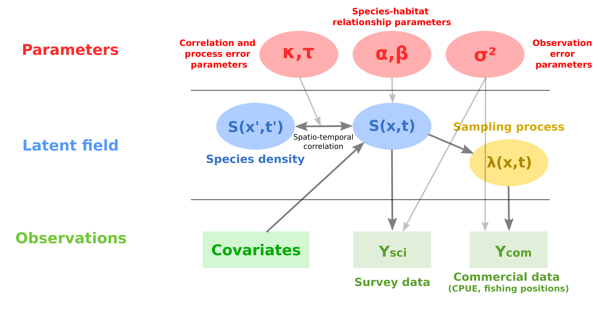
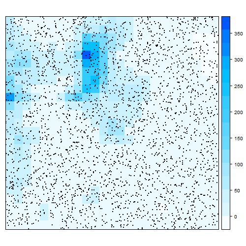
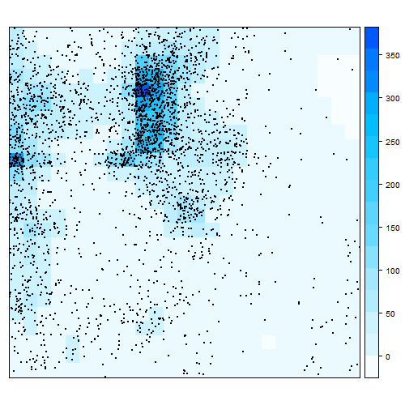
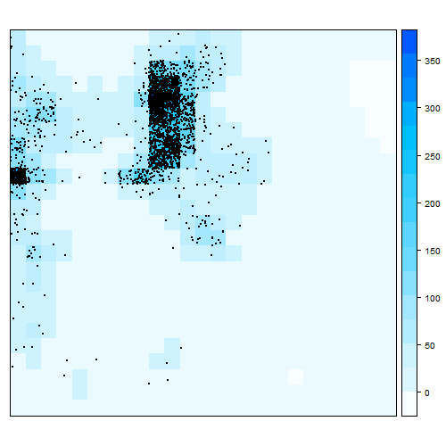

```{r setup, include=FALSE}

knitr::opts_chunk$set(echo = TRUE)

library(dplyr)
library(tidyr)
library(rnaturalearth)
library(stringr)
library(sf)
library(maps)
library(ggplot2)
library(ggspatial)
library(cowplot)

col_scale <- function(palette = "Spectral", name = "", limits = NULL) {
  scale_colour_distiller(palette = palette,   # spectral colour scale
                         guide = "colourbar", # continuous colour bar
                         name = name,
                         limits = limits)
}

```


# Context

## Essential Fish Habitats

\begin{columns}
\begin{column}{0.5\textwidth}
Fishery ressources renewal highly rely on some key areas called\\
\textbf{Essential Fish Habitats (EFH)} :
\tiny \vspace{\baselineskip} \normalsize
\begin{itemize}
\item Spawning and reproduction grounds
\item Nursery grounds
\item Migration routes
\end{itemize}
\onslide<2>{
\center \Large \textbf{\textcolor{BaptisteBlue}{$\Downarrow$}}

\center \normalsize \textbf{\textcolor{BaptisteBlue}{Identify and caracterise these areas ?}}
}


\end{column}
\begin{column}{0.4\textwidth}

\begin{figure}[htb]
  \centering
  \includegraphics[width = 5cm]{"images/Brown_et_al_2018.png"}\quad
  \caption{\tiny Conceptual diagram of common life-history stages of fish in coastal habitats: S = mature adults during spawning, J = immature juveniles, and F = feeding adults not in spawning. Arrows represent migrations (M).}
\end{figure}
\end{column}
\end{columns}

\hfill \tiny [@brownConflictsCoastalZone2018]

<!-- \begin{columns} -->
<!-- \column{0.5\textwidth} -->
<!-- <!-- Context: -->
<!-- <!-- - -->
<!-- - truc -->
<!-- \column{0.5\textwidth} -->
<!-- \end{columns} -->

## Data

### Scientific data

```{r,include=F,warning=FALSE}

load("res/ptsurvey_wgs84_full.RData")

load("map/strata_ZN.RData")
load("map/strata_ZCC.RData")
load("map/strata_ZCL.RData")
load("map/strata_ZS.RData")

mapBase <- ne_countries(scale = "medium", returnclass = "sf")

plot_1 <- ggplot()+
    geom_sf(data = strata_ZN,
            alpha = 0.35,
            size = 0.75,
            color="#7FC97F",
            fill ="#7FC97F")+
    geom_sf(data = strata_ZS,
            alpha = 0.35,
            size = 0.75,
            color="#FFED6F",
            fill="#FFED6F")+
    geom_sf(data = strata_ZCC,
            alpha = 0.35,
            size = 0.75,
            color="white",
            fill="white")+
    geom_sf(data = strata_ZCL,
            alpha = 0.35,
            size = 0.75,
            color="#EF8A62",
            fill="#EF8A62")+
    geom_sf(data = mapBase)+
    geom_point(data = ptsurvey_wgs84_full,
               aes(x=long,y=lati,col = Sci.obs_spp))+
    coord_sf(xlim = c(-6,0), ylim = c(43,48+0.25), expand = FALSE)+
      theme(aspect.ratio = 1,legend.title = element_blank(),
          panel.border = element_blank(),
          panel.grid.major = element_blank(),
          panel.grid.minor = element_blank(),
          panel.background = element_rect(fill = "skyblue"),
          legend.position = "none")+
    scale_color_gradient(low = "white", high = "red")+
  xlab("")+ylab("")+
  annotation_scale(location = "bl", line_width = .5) +
  annotation_north_arrow(location = "tl", height = unit(0.7, "cm"), width = unit(0.7, "cm"))

```


\begin{columns}
\begin{column}{0.4\textwidth}
\center \huge \textbf{\textcolor{BaptisteBlue}{\ding{58}}} \\
\normalsize
\begin{itemize}
\item Standardized sampling plan
\end{itemize}
\center \Huge \fontsize{45}{15}{\textbf{\textcolor{BaptisteBlue}{-}}} \\
\normalsize
\begin{itemize}
\item Expensive
\item Sparse and limited spatio-temporal coverage
\end{itemize}
\end{column}
\begin{column}{0.6\textwidth}

```{r, echo=FALSE, fig.align='center',out.width="120%",fig.cap="Orhago survey data - 2018"}

plot(plot_1)

```

\end{column}
\end{columns}


### Commercial data (VMS x logbooks)

```{r,include=F,warning=FALSE}

load("map/ICES_rect.RData")
load("res/points_sf.RData")

ICES_rect_2 <- ICES_rect %>%
  filter(str_detect(ICESNAME,"24E|23E|22E|21E|20E|19E|18E|17E|16E|15E"))

vms_plot <- points_sf %>%
  filter(str_detect(SI_DATE,"11/2018")) %>%
  # geom_sf_label(data = ICES_rect,aes(label = ICESNAME))+
  ggplot()+
  geom_sf(data = ICES_rect_2,fill="skyblue")+
  geom_sf(data = mapBase)+
  theme(panel.background = element_rect(fill = "skyblue"))+
  geom_sf(col="black")+
  coord_sf(xlim = c(-6,1), ylim = c(43,48), expand = FALSE)+
  theme(legend.position = "none")+
  annotation_scale(location = "bl", line_width = .5) +
  annotation_north_arrow(location = "tl", height = unit(0.7, "cm"), width = unit(0.7, "cm"))


```

\begin{columns}
\begin{column}{0.4\textwidth}
\center \huge \textbf{\textcolor{BaptisteBlue}{\ding{58}}} \\
\footnotesize
\begin{itemize}
\item Available data on the full year and dense coverage
\item Costless (for scientists)
\end{itemize}
\vspace{\baselineskip}
\center \fontsize{45}{15}{ \textbf{\textcolor{BaptisteBlue}{-}} } \\
\footnotesize
\begin{itemize}
\item Preferential behavior towards ressource
\item Non-homogeneous fleets (varying catchability and targeting behavior)
\item Reallocation of landings data on VMS pings
\end{itemize}
\end{column}
\begin{column}{0.6\textwidth}

```{r, echo=FALSE, fig.align='center',out.width="120%",fig.cap="VMS data for otter trauls (OTB-DEF) - November 2018"}

plot(vms_plot)

```

\end{column}
\end{columns}

## Scientific question and objectives

\centering \large Development of a hierarchical spatio-temporal model combining scientific and commercial data to infer fish spatial distribution

\vspace{\baselineskip}

\textbf{\textcolor{BaptisteBlue}{$\Rightarrow$}} Identification of Essential Fish Habitats (with a focus on spawning grounds)

\onslide<2>{

\vspace{\baselineskip}
\vspace{\baselineskip}

\raggedright \textbf{4 main dimensions :}

\vspace{\baselineskip}

\centering \textbf{\textcolor{BaptisteBlue}{Methodology} \quad \textcolor{BaptisteLightGreen}{Ecology} \quad \textcolor{orange}{Fishery} \quad \textcolor{yellow}{Management}}

}


# Spatio-temporal model

{width=105%}


## Sampling process


---

{width=70%}

---

{width=70%}

---

{width=70%}

---

::: {.block}
###
$$
\textcolor{BaptisteOrange}{\mathrm{X}_{com \,f }} \sim
\mathcal{IPP}(\textcolor{BaptisteOrange}{\lambda_f(x,t)})
$$
$$
log(\textcolor{BaptisteOrange}{\lambda_f(x,t)})=
\textcolor{BaptisteOrange}{\alpha_{X\,f}(t)} +
\textcolor{BaptisteOrange}{b_f(t)} . \log(\textcolor{BaptisteBlue}{S(x,t)})+
\textcolor{BaptisteOrange}{\eta_f(x,t)}
$$
:::

\vspace{\baselineskip}

\begin{columns}

\column{0.5\textwidth}

\scriptsize
\begin{itemize}

\item $\textcolor{BaptisteOrange}{\mathrm{X}_{com \,f }}$ : inhomogeneous point process

\item $\textcolor{BaptisteOrange}{\lambda_f(x,t)}$ : commercial sampling intensity

\item $\textcolor{BaptisteOrange}{\alpha_{X\,f}(t)}$ : intercept (seasonnal and yearly variation)

\item $\textcolor{BaptisteOrange}{b_f(t)}$ : targeting parameter

\item $\textcolor{BaptisteBlue}{S(x,t)}$ : biomass field

\item $\textcolor{BaptisteOrange}{\eta(x,t)} \sim N(0, Q_S^{-1})$

\item $f$ : fleet

\end{itemize}

\column{0.5\textwidth}
```{r, echo=FALSE, fig.align='center',out.width="75%"}

```
\end{columns}


# Fitting the model and analysing outputs

## Case study

<!-- \item Yearly survey  \tiny (November) \scriptsize -->


\scriptsize
\begin{itemize}
\item Bay of Biscay common sole \tiny (catch = landings, well-known ecology, commercial interest) \scriptsize
\item Commercial data from otter trawls targeting demersal species \tiny (fishing time as proxy of effort, good coverage of the area, relatively homogeneous catchability and targeting behavior) \scriptsize
\item Filter mature fraction of landings
\item Period : 2008 - 2018, monthly time step \tiny (132 time steps)
\end{itemize}


```{r,echo=F}

if(!file.exists("images/HF_OTB_DEF_plot.RData") & !file.exists("images/HF_OTB_CEP_plot.RData") & !file.exists("images/HF_OTB_DEF_plot.RData")){
  
  load("res/OTB_mature_commercial_data.RData")
  
  HF_OTB_DEF_plot <- ptvms_wgs84 %>%
    filter(str_detect(LE_MET_level6,"OTB_DEF_>=70_0")) %>%
    group_by(long,lati) %>%
    dplyr::summarise(HF = sum(HF)) %>%
    # filter(HF > 4) %>%
    ggplot()
  
  save(file="images/HF_OTB_DEF_plot.RData",data=HF_OTB_DEF_plot)
  
  HF_OTB_CEP_plot <- ptvms_wgs84 %>%
    filter(str_detect(LE_MET_level6,"OTB_CEP_>=70_0")) %>%
    group_by(long,lati) %>%
    dplyr::summarise(HF = sum(HF)) %>%
    # filter(HF > 4) %>%
    ggplot()
  
  save(file="images/HF_OTB_CEP_plot.RData",data=HF_OTB_CEP_plot)
  
  load("res/OTT_mature_commercial_data.RData")
  
  HF_OTT_DEF_plot <- ptvms_wgs84 %>%
    filter(str_detect(LE_MET_level6,"OTT_DEF_>=70_0")) %>%
    group_by(long,lati) %>%
    dplyr::summarise(HF = sum(HF)) %>%
    ggplot()
    # filter(HF > 4) %>%
    
  
  save(file="images/HF_OTT_DEF_plot.RData",data=HF_OTT_DEF_plot)
  
}else{
  
  load("images/HF_OTB_DEF_plot.RData")
  load("images/HF_OTB_CEP_plot.RData")
  load("images/HF_OTT_DEF_plot.RData")
  
}

```

```{r,echo=F,fig.align='center',out.width="100%",fig.cap="Orhago catch weights for sole - All data from 2008 to 2018."}

# load("res/Survey.data_catch_wgt.RData")
# Survey.data_catch_wgt %>%
#   ggplot()+
#   # geom_sf(data = ICES_rect_2,fill="skyblue")+
#   theme(panel.background = element_rect(fill = "skyblue"),
#         legend.title = element_blank())+
#   geom_point(aes(x=long,y=lati,col=CatchWgt_Solea_solea))+
#   scale_color_gradient2(midpoint = 1,
#                         low = "mediumpurple1",
#                         mid = "white",
#                         high = "red",
#                         space = "Lab" )+
#   geom_sf(data = mapBase)+
#   coord_sf(xlim = c(-6,1), ylim = c(43,48), expand = FALSE)+
#   # theme(legend.position = "none")+
#   # annotation_scale(location = "bl", line_width = .5)+
#   # annotation_north_arrow(location = "tl", height = unit(0.7, "cm"), width = unit(0.7, "cm"))+
#   xlab("")+ylab("")

```


\begin{columns}
\begin{column}{0.6\textwidth}

```{r,echo=F,fig.align='center',out.width="80%",fig.cap="Map of effort in fishing hours - Otter trawls targeting demersal fish (OTB-DEF) - Agregated data from 2008 to 2018."}

HF_OTB_DEF_plot_2 <- HF_OTB_DEF_plot + 
    # geom_sf(data = ICES_rect_2,fill="skyblue")+
    theme(panel.background = element_rect(fill = "skyblue"),
          legend.title = element_blank())+
  geom_point(aes(x=long,y=lati,col=HF),size=2.5,shape=15)+
  scale_color_gradient2(midpoint = 1,
                          low = "mediumpurple1",
                          mid = "white",
                          high = "red",
                          space = "Lab" )+
    geom_sf(data = mapBase)+
    coord_sf(xlim = c(-6,1), ylim = c(43,48), expand = FALSE)+
    # theme(legend.position = "none")+
    # annotation_scale(location = "bl", line_width = .5)+
    # annotation_north_arrow(location = "tl", height = unit(0.7, "cm"), width = unit(0.7, "cm"))+
    xlab("")+ylab("")

plot(HF_OTB_DEF_plot_2)

```

\end{column}
\begin{column}{0.4\textwidth}

\begin{figure}
  \centering
  \includegraphics[width = 3cm]{"images/solea_solea.png"}\quad
  \caption{\tiny \textit{Solea solea} (Linnaeus, 1758)}
\end{figure}

\end{column}
\end{columns}


## Predictions of the relative biomass random field

```{r,include=F,warning=F}

## Load model outputs
load("res/fit_IM_res_b.season.year.RData")
load("res/loc_x_pred.RData")
SD <- fit_IM_res$SD
Report <- fit_IM_res$Report

time_step_t <- 1:12
year_y <- 2008:2018
time.step_df <- expand.grid(time_step_t,year_y)
colnames(time.step_df) <- c("Month","Year")
time.step_df <- time.step_df %>%
  arrange(Year,Month) %>%
  mutate(Month = ifelse(Month < 10,paste0("0",Month),Month)) %>%
  mutate(Year_Month = paste0(Year,"_",Month)) %>%
  mutate(t = 1:nrow(time.step_df))
    

# Build data
S_x_df <- cbind(loc_x_pred[,c("cell","x","y")],S_x = Report$S_p[1:nrow(loc_x_pred),]) %>%
  pivot_longer(cols = starts_with("S_x."),names_to = "t", values_to = "S_x") %>%
  mutate(t = as.numeric(str_replace(t,"S_x.",""))) %>%
  inner_join(time.step_df)
  
Ab_df <- S_x_df %>%
  group_by(Year_Month) %>%
  dplyr::summarise(Ab = sum(S_x))

S_x_df <- inner_join(S_x_df,Ab_df) %>%
  mutate(S_x_rel = S_x/Ab)

## time step
time_step_df <- S_x_df %>%
  group_by(Year_Month) %>%
  dplyr::select(Year_Month) %>%
  slice(1)
time_step_df$time_step = c(1:nrow(time_step_df))

```


```{r,echo=F,fig.align="center",warning=F,out.width="275px",fig.cap="Monthly relative distribution of sole for the year 2018"}

plot_S_x <- ggplot() +
    geom_point(data = S_x_df[which(str_detect(S_x_df$Year_Month,as.character(2018))),],
               aes(x=x,y=y,col = S_x_rel))+
    geom_sf(data = mapBase)+
    coord_sf(xlim = c(-6,0), ylim = c(43,48), expand = FALSE)+
    scale_color_gradient(low = "white", high = "red")+xlab("")+ylab("")+
    theme(aspect.ratio = 1,
          legend.title = element_blank(),
          panel.border = element_blank(),
          panel.grid.major = element_blank(),
          panel.grid.minor = element_blank(),
          panel.background = element_rect(fill = "skyblue"),
          panel.spacing.x = unit(6, "mm"),
          legend.position = "none")+
    facet_wrap(.~Year_Month)

plot(plot_S_x)

```


## Spatial patterns (EOF)

How to summarize the information of 132 maps and extract the main distribution patterns ? 
\onslide<2-3>{
\tiny\newline
\center \large \textcolor{BaptisteBlue}{\textbf{$\Rightarrow$ Empirical Orthogonal Functions (EOF)}}
}
\onslide<3>{
$$\overrightarrow{\mathbf{S}}^*_{t}=\sum_{k=1}^{K} \alpha_{k}(t) \vec{p}^{k}+\vec{n}_{t}$$
\footnotesize
\raggedright
\begin{itemize}
\item $\overrightarrow{\mathbf{S}}^*_{t}$ : normalized biomass field.

\item $\vec{p}^{k}$ : maps (or spatial patterns) which capture best the variance of $\overrightarrow{\mathbf{S}}^*_{t}$.

\item $\alpha_{k}(t)$ : temporal index informing when $\overrightarrow{\mathbf{S}}^*_{t}$ is distributed following the spatial pattern $\vec{p}^{k}$.

\item $\vec{n}_{t}$ : noise \tiny (or none relevant variation of the variable of interest).
\end{itemize}
\tiny


}

\hfill \tiny @vonstorchSpatialPatternsEOFs1999; @wikleSpatiotemporalStatistics2019


---

```{r,include=F,warning=F}

nEOF <- 10
EOF_mat <- S_x_df %>%
  dplyr::select(cell,Year_Month,S_x_rel) %>%
  dplyr::rename(S_x = S_x_rel) %>%
  pivot_wider(names_from = Year_Month,values_from = S_x) %>%
  as.matrix() %>% t()
EOF_mat <- EOF_mat[-1,]

# Compute mean pattern
spat_mean <- apply(EOF_mat, 2, mean)
spat_mean_df <- cbind(loc_x_pred,spat_mean = spat_mean)
nT <- nrow(EOF_mat)

## Then subtract and standardize
Zspat_detrend <- EOF_mat - outer(rep(1, nT), spat_mean)
Zt <- 1/sqrt(nT - 1)*Zspat_detrend

## Singular value decomposition
E <- svd(Zt)
V <- E$v
colnames(E$v) <- paste0("EOF", 1:nrow(EOF_mat)) # label columns
EOFs <- cbind(loc_x_pred[,c("x","y","cell")], E$v)
TS <- data.frame(E$u) %>%        # convert U to data frame
  mutate(t = 1:nrow(E$u)) %>%    # add a time field
  gather(eof, PC, -t)            # put columns (except time) into long-table format with EOF-PC as key-value pair
TS$nPC <- TS$PC * sqrt(nT-1)

eigen_df <- data.frame(eigen.values = E$d,perc.var = E$d/sum(E$d),cum.perc.var = cumsum(E$d/sum(E$d)),EOF=1:length(E$d))

EOFs_2 <- EOFs %>%
  select_at(c("x","y","cell",paste0("EOF",1:nEOF))) %>%
  pivot_longer(cols = starts_with("EOF")) %>%
  dplyr::rename(EOF = name) %>%
  filter(EOF=="EOF1" | EOF=="EOF2")

EOF_map <- ggplot(EOFs_2) + 
  geom_point(aes(x = x, y = y, col = -value)) +
  col_scale(name = "S_x") + theme_bw() + # ,limits = c(-0.1,0.1)
  # geom_sf(data = limites_orhago,size=1.5,col="skyblue")+
  geom_sf(data=mapBase)+
  xlab("Longitude (deg)") + ylab("Latitude (deg)") +
  coord_sf(xlim = c(-6,0), ylim = c(43,48), expand = FALSE)+
  theme(legend.title = element_blank()) +
  facet_wrap(.~EOF)


## Time series
EOFset1 <- E$u[1:(nT), 1:nEOF] * sqrt(nT - 1)
EOFset1 <- EOFset1 %>% data.frame
colnames(EOFset1) <- paste0("PC",1:nEOF)
EOFset1_2 <- EOFset1 %>%
  mutate(time_step = 1:nrow(EOFset1)) %>%
  pivot_longer(cols = starts_with("PC")) %>%
  dplyr::rename(PC = name) %>%
  filter(PC == "PC1") %>%
  inner_join(time_step_df)

EOF_ts <- ggplot()+
  geom_point(data = EOFset1_2,aes(x=Year_Month,y=-value,col=PC,group=PC),size=2)+
  geom_line(data = EOFset1_2,aes(x=Year_Month,y=-value,col=PC,group=PC),size=1)+
  geom_vline(xintercept=EOFset1_2$Year_Month[which(str_detect(EOFset1_2$Year_Month,"_02"))],linetype="dashed", color = "skyblue", size = 1)+
  geom_hline(yintercept = 0,linetype="dashed", color = "grey", size = 1)+
  theme_bw() +
  xlab("")+ylab("")+
  # facet_wrap(.~PC,ncol = 1) +
  theme(legend.position = "none",
        axis.text.x = element_blank(),
        legend.title = element_blank(),
        plot.margin = margin(2, 2, 2, 2, unit = "pt"))+
  geom_text(aes(x = -Inf, y = -Inf, label = "2008"), hjust = -.10, vjust = 1.5) +
  geom_text(aes(x = max(EOFset1_2$Year_Month), y = -Inf, label = "2018"), hjust = 1, vjust = 1.5) +
  coord_cartesian(clip = "off")

  

```


```{r,echo=F,fig.align="center",out.width="300px",fig.cap="First EOF map (up) and related principal component (down). Blue line : February (reproduction period)."}

plot_grid(EOF_map,NULL,EOF_ts,ncol = 1,rel_heights = c(2,0.1,2))

```

---

\begin{columns}
\begin{column}{0.65\textwidth}

```{r,echo=F,fig.align="center",warning=F,fig.cap="First EOF map - Main spatial pattern"}

plot(EOF_map)

```

\end{column}
\begin{column}{0.35\textwidth}

\begin{figure}[htb]
  \centering
  \includegraphics[width = 4cm]{"images/arbault_et_al_1986.png"}\quad
  \caption{\tiny Eggs and Larvae distribution}
\end{figure}
\end{column}
\end{columns}
\hfill \tiny [@arbaultEstimationStockSole1986]


## Targeting parameter

\begin{columns}
\begin{column}{0.4\textwidth}

\centering \textbf{Parameters \textcolor{BaptisteOrange}{$b_f(t)$}}

\tiny \vspace{\baselineskip}

\footnotesize \textcolor{BaptisteGrey}{[0.8 ; 1.2]}

\end{column}
\begin{column}{0.2\textwidth}

\centering \textbf{vs.}

\end{column}
\begin{column}{0.4\textwidth}

\centering \textbf{Proportion of sole in landings}

\tiny \vspace{\baselineskip}

Alternative targeting indicator

\vspace{\baselineskip}

\footnotesize \textcolor{BaptisteGrey}{[2,5 \% ; 7.5 \%]}

\end{column}
\end{columns}

```{r,include=F}

load("res/fit_IM_res_b.season.year.RData")
SD <- fit_IM_res$SD
Report <- fit_IM_res$Report
b_season <- data.frame(Month = 1:12,
b_season=c(0,SD$par.fixed[which(names(SD$par.fixed)=="par_bseason")])) %>%
  mutate(Month = ifelse(Month<10,paste0("0",Month),Month)) # %>%
b_year <- data.frame(Year = 2008:2018,
                     b_year=c(0,SD$par.fixed[which(names(SD$par.fixed)=="par_byear")]))
b.seasonal_df <- inner_join(time.step_df,b_season)
b.seasonal_df <- inner_join(b.seasonal_df,b_year)
b.seasonal_df <- b.seasonal_df %>%
  mutate(b = SD$par.fixed[which(names(SD$par.fixed)=="par_b")]) %>%
  mutate(b_seas.year = b + b_season + b_year)
  

load("res/fit_IM_res_b.norm.RData")
SD <- fit_IM_res$SD
Report <- fit_IM_res$Report
b.norm_df <- cbind(time.step_df,b_norm = SD$par.random[which(names(SD$par.random)=="par_b")])

load("res/catch_prof_full_df_3.RData")
catch_prof_full_df_4 <- catch_prof_full_df_3 %>%
  filter(spp == "Solea_solea") %>%
  mutate(LE_KG_rel.wgt = LE_KG * LE_KG_rel )

b_df <- inner_join(b.seasonal_df,b.norm_df)
b_df <- inner_join(b_df,catch_prof_full_df_4[,c("Year_Month","LE_KG_rel","LE_KG_rel.wgt")])

```

\vspace{\baselineskip}

```{r,echo=F,fig.align="center",fig.asp=1/3,warning=F,out.width="300px"}

b_seas.year_vec <- (b_df$b_seas.year) / (sd(b_df$b_seas.year))
LE_KG_rel_vec <- (b_df$LE_KG_rel)/(sd(b_df$LE_KG_rel))
b_norm_vec <- (b_df$b_norm)/(sd(b_df$b_norm))

# plot(b_seas.year_vec,LE_KG_rel_vec)
# cor.test(b_seas.year_vec,LE_KG_rel_vec,method = "pearson")
# plot(b_norm_vec,LE_KG_rel_vec)
# cor.test(b_norm_vec,LE_KG_rel_vec,method = "pearson")

b_plot <- ggplot(data=b_df,aes(x=Year_Month,group=1))+
  
  geom_point(aes(y= (b_seas.year - mean(b_seas.year)) / (sd(b_seas.year)),color="b parameters"),size = 2)+
  geom_line(aes(y= (b_seas.year - mean(b_seas.year)) / (sd(b_seas.year)),color="b parameters"),size = 1)+
  
  geom_point(aes(y=(LE_KG_rel - mean(LE_KG_rel))/(sd(LE_KG_rel)),color="Sole proportion in landings"),size = 2,alpha = 0.75)+
  geom_line(aes(y=(LE_KG_rel - mean(LE_KG_rel))/(sd(LE_KG_rel)),color="Sole proportion in landings"),size = 1,alpha = 0.75)+
  
  # geom_point(aes(y=(b_norm - mean(b_norm))/(sd(b_norm)),color="b_random"),size = 2,alpha = 0.75)+
  # geom_line(aes(y=(b_norm - mean(b_norm))/(sd(b_norm)),color="b_random"),size = 1,alpha = 0.75)+
  
  geom_vline(xintercept=b_df$Year_Month[which(str_detect(b_df$Year_Month,"_02"))],linetype="dashed", color = "skyblue", size = 1)+
  theme_bw()+xlab("")+
  ylab("")+
  
  theme(legend.text = element_text(size=14),
        axis.text.x = element_blank(),
        legend.title = element_blank(),
        plot.margin = margin(0, 0, 0, 0, unit = "pt"),
        legend.position = "bottom",
        aspect.ratio = 1/4)+
  geom_text(aes(x = -Inf, y = -Inf, label = "2008"), hjust = -.10, vjust = 1.5) +
  geom_text(aes(x = max(b_df$Year_Month), y = -Inf, label = "2018"), hjust = 1, vjust = 1.5) +
  coord_cartesian(clip = "off")

plot(b_plot)

```

\tiny
Variables have been normalized

# Discussion 

## Conlusions

Approach with the potential to :

\tiny \vspace{\baselineskip} \normalsize
\begin{itemize}

\item capture main spatial patterns of the exploited fraction of the population \onslide<2-4>{\textbf{\textcolor{BaptisteBlue}{$\Leftrightarrow$ reproduction ecology of sole}}}

\tiny \vspace{\baselineskip} \normalsize

\onslide<3-4>{\item estimate the strength of targeting towards the species of interest and its evolution in time}

\vspace{\baselineskip}

\onslide<4>{\centering \large \textcolor{BaptisteGrey}{\textbf{$\Rightarrow$ Need for expert validation and additional applications}}}

\end{itemize}

## Perspectives

\begin{itemize}

\item Application to other case studies / other geographic areas

\begin{figure}
    \begin{tabular}{c c c c}
    \includegraphics[width=2cm]{images/merluccius_merluccius.jpg} &
    \includegraphics[width=2cm]{images/dicentrarchus_labrax.jpg} &
    \includegraphics[width=1.75cm]{images/lophius_spp.jpg} &
    \includegraphics[width=2cm]{images/sardina_pilchardus.jpg} \\
    \tiny \textbf{Hake} &
    \tiny \textbf{Sea bass} &
    \tiny \textbf{Anglerfish} &
    \tiny \textbf{Pilchard}\\
    \end{tabular}
\end{figure}
\tiny \vspace{\baselineskip} \normalsize

\onslide<2-3>{\item Extension of the model to include a multispecific targeting component and other drivers of targeting (tradition, management, etc.)}

\vspace{\baselineskip}

\onslide<3>{\item Effect of landings reallocation on vessel GPS positions ? How does it affect model outputs ? How to account for reallocation in the modelling approach ?}

\end{itemize}

---

\centering \Large \textcolor{BaptisteGrey}{\textbf{Thank you for your attention!}}

\tiny \vspace{\baselineskip}

\begin{figure}
    \begin{tabular}{c c}
    \includegraphics[width=4.5cm]{images/peche_afrique_artisanale.jpg} &
    \includegraphics[width=4.5cm]{images/peche_artisanale.jpg} \\
    \includegraphics[width=4.5cm]{images/peche_hauturiere.jpg} &
    \includegraphics[width=4.5cm]{images/thon_rouge.jpg}
    \end{tabular}
\end{figure}

# Bibliography

\tiny